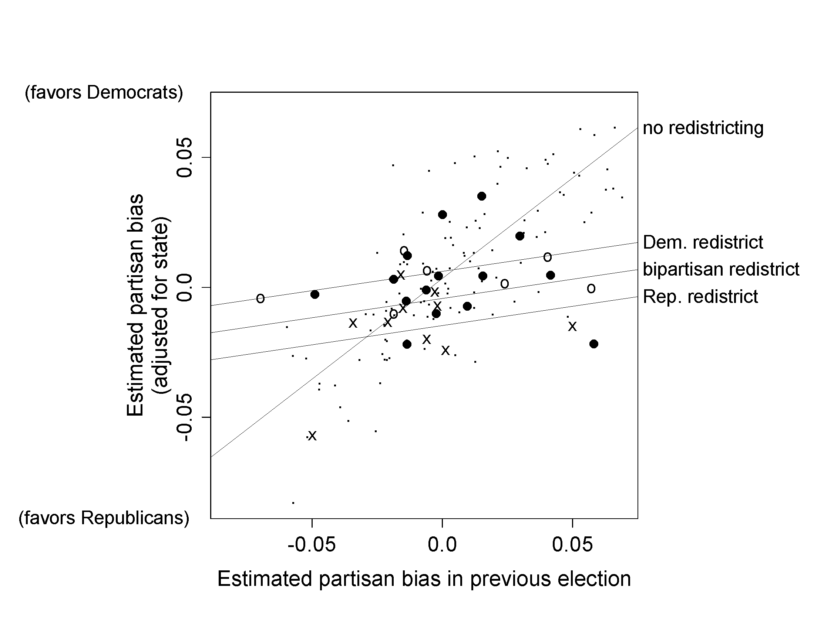

# Data and Measurement

모델을 적합하기에 앞서, 모델에 사용할 데이터와 측정지표를 탐색하고 이해할 필요가 있다.

## Examining where data come from

```{r, echo = F, fig.cap = "Map that appeared on the internet of the so-called ``Human Development Index,'' ranking the 50 states and Washington, D.C., from PlatypeanArchcow (2009)."}
# devtools::install_github("dcl-docs/ussf")
library(tidyverse)
library(patchwork)
library(haven)
library(sf)

# Parameters
  # Human Development Index data
file_hdi <- here::here("data/ros-master/HDI/data/hdi.dat")
  # Data that includes state income
file_income <- here::here("data/ros-master/HDI/data/state vote and income, 68-00.dta")

hdi <- 
  file_hdi %>% 
  read.table(header = TRUE) %>% 
  as_tibble() %>% 
  select(state, hdi, hdi_rank = rank, canada_dist = canada.dist)

income <- 
  file_income %>% 
  read_dta() %>% 
  filter(st_year == 2000) %>% 
  select(
    state = st_state,
    state_abbr = st_stateabb,
    income_2000 = st_income
  ) %>% 
  mutate(income_2000_rank = min_rank(-income_2000))

hdi_income <- 
  hdi %>% 
  full_join(income, by = "state")
us <- ussf::boundaries(geography = "state")
us_hdi <- 
  us %>% 
  left_join(
    hdi %>% 
      mutate(
        state = str_replace(state, "Washington, D.C.", "District of Columbia")
      ),
    by = c("NAME" = "state")
  )
us_hdi %>% 
  ggplot() +
  geom_sf(aes(fill = hdi)) +
  scale_fill_distiller(palette = "YlGnBu", direction = 1) +
  theme_void() +
  theme(plot.title = element_text(hjust = 0.5)) +
  labs(
  #  title = "Human Development Index by state",
    fill = "HDI"
  ) + theme(legend.position = "bottom")
```

```{r, echo = F, fig.width=8, fig.height=4, fig.cap = "Graphing the Human Development Index versus average income by state: (a) scatterplot of the data, (b) scatterplot of ranks."}


fig2.2a <- hdi_income %>% 
  drop_na(income_2000) %>% 
  ggplot(aes(income_2000, hdi)) +
  geom_point() + 
  ggrepel::geom_text_repel(aes(label = state_abbr),
                           force_pull    = 0,
                           max.time      = 0.5,
                           max.iter      = 1e5,
                           max.overlaps  = Inf,
                           segment.color = NA,
                           point.padding = NA
                           ) +
  geom_abline() + 
  labs(
    #title = "Human Development Index vs. average state income",
    x = "Average state income in 2000",
    y = "Human Development Index"
  ) + theme_bw()

fig2.2b <- hdi_income %>% 
  drop_na(income_2000_rank) %>%
  ggplot(aes(income_2000_rank, hdi_rank)) +
  geom_point() +
  ggrepel::geom_text_repel(aes(label = state_abbr),
                           force_pull    = 0,
                           max.time      = 0.5,
                           max.iter      = 1e5,
                           max.overlaps  = Inf,
                           segment.color = NA,
                           point.padding = NA
                           ) +
  scale_x_reverse() +
  scale_y_reverse() +
  labs(
    #title = "Human Development Index rank vs. state income rank",
    x = "State income rank in 2000",
    y = "Human Development Index rank"
  ) + theme_bw()

fig2.2a + fig2.2b + plot_layout(ncol = 2)
```

Figure 2.1은 Human Development Index (HDI)를 워싱턴 DC와 50개 주를 비교한 지도이다. 이 지도가 우리가 생각하는 주들 간 공중보건 수준을 현실적으로 반영하고 있을까?

HDI는 세 가지 차원으로 측정된다:

  + 기대수명(life expectancy)
  
  + 성인 문해율(adult literacy rate)과 초중고등 교육 등록률(primary, secondary, and tertiary gross enrollment ratio)
  
  + 구매력을 기준으로 한 일인당 국내총생산(GDP)에 자연로그를 취한 값: 생활 수준(standard of living)
  
즉, HDI는 위의 세 지표를 결합한 것이기 때문에 역으로 특정 지표의 값이 높지만 나머지 지표의 값이 낮은 주와 평균적으로 세 지표 모두를 중간 수준의 값으로 가지는 주 간의 차이를 구분하지 못할 수 있다는 것이다.

Figure 2.2는 HDI와 주들 간 평균 소득 수준을 비교한 플롯이다. Figure 2.2a는 두 변수 간 관계가 강하지만 비선형적이라는 것을 보여주며, Figure 2.2b는 평균 소득 순위와 HDI 순위 간 관계가 매우 선명한 선형 관계를 가지고 있다는 것을 보여주고 있다. 이 예시는 다른 방법으로 그래프를 그림으로써 데이터를 더 잘 이해할 수 있다는 것을 보여준다.

### Details of measurement can be important

미국정치는 거대 양당에 의해 주도되고 있지만 이념적 스펙트럼에 있어서는 그 강도에 따라 세분화할 수 있다. 그러나 당파성과 이념적 척도는 동일하지 않다.

+ Figure 2.3a는 자기이념에 있어서 진보-중도-보수의 비율이 모든 소득 수준에서 비슷한 것으로 나타난다.

+ Figure 2.3b는 당파성에 있어서 소득 수준이 적어도 2008년 기준으로는 공화당 당파성과 강한 관계가 있음을 보여준다.

회귀모델은 데이터를 요약하고, 데이터로부터 추론을 도출하는 방법이다. 따라서 회귀모델은 분석하고자 하는 데이터의 질(quality of data)과 연구문제에 대한 데이터의 적실성에 좌우된다. 측정지표와 현실 간 간극은 과학적 연구에 있어서 일반적인 문제이다.

```{r, echo = F, fig.width=8, fig.height=8, fig.cap="Distribution of (a) political ideology and (b) party identification, by income, from a survey conducted during the 2008 U.S. election campaign."}
file_pew <- here::here("data/ros-master/Pew/data/pew_research_center_june_elect_wknd_data.dta")

pew <- 
  read_dta(file_pew) %>% 
  mutate(across(where(is.labelled), as_factor))

income_recode <- 
  levels(pew$income) %>% 
  set_names(
    levels(pew$income) %>% 
      str_replace("less", "Less") %>% 
      str_replace("-", " - ")
  )

pew <- 
  pew %>% 
  mutate(income = na_if(income, "dk/refused") %>% fct_recode(!!! income_recode))

pew <- 
  pew %>% 
  mutate(
    party_5 =
      case_when(
        party == "democrat" ~ "Democrat",
        party == "republican" ~ "Republican",
        partyln == "lean democrat" ~ "Lean Democrat",
        partyln == "lean republican" ~ "Lean Republican",
        party == "independent" ~ "Independent",
        TRUE ~ NA_character_
      ) %>% 
      fct_relevel(
        "Democrat",
        "Lean Democrat",
        "Independent",
        "Lean Republican",
        "Republican"
      )
  )

ideo_recode <- 
  levels(pew$ideo) %>% 
  set_names(levels(pew$ideo) %>% str_to_title())

pew <-  
  pew %>% 
  mutate(ideo = na_if(ideo, "dk/refused") %>% fct_recode(!!! ideo_recode))

v <- 
  pew %>% 
  drop_na(income, ideo) %>% 
  group_by(income, ideo) %>% 
  summarize(n = sum(weight)) %>% 
  mutate(prop = n / sum(n)) %>% 
  ungroup()

v %>% 
  ggplot(aes(income, prop, group = ideo)) +
  geom_line(aes(color = ideo)) +
  ggrepel::geom_text_repel(
    aes(label = ideo),
    data = . %>% slice_max(order_by = income, n = 1),
    nudge_x = 0.2,
    direction = "y",
    hjust = 0
  ) +
  scale_x_discrete(expand = expansion(mult = c(0.1, 0.35)),
                   guide = guide_axis(n.dodge=2)) +
  scale_y_continuous(labels = scales::label_percent(accuracy = 1)) +
  coord_cartesian(ylim = c(0, NA)) +
  theme(
    axis.text.x = element_text(angle = -45, hjust = 0),
    legend.position = "none"
  ) +
  labs(
    title = "Self-declared political ideology by income in 2008",
    x = "Income",
    y = "Percentage of income group"
  ) + theme_bw() + theme(legend.position = "bottom",
                         legend.title = element_blank()) -> fig2.3a

v <- 
  pew %>% 
  drop_na(income, party_5) %>% 
  group_by(income, party_5) %>% 
  summarize(n = sum(weight)) %>% 
  mutate(prop = n / sum(n)) %>% 
  ungroup()

v %>% 
  ggplot(aes(income, prop, group = party_5)) +
  geom_line(aes(color = party_5)) +
  ggrepel::geom_text_repel(
    aes(label = party_5),
    data = . %>% slice_max(order_by = income, n = 1),
    nudge_x = 0.2,
    direction = "y",
    hjust = 0
  ) +
  scale_x_discrete(expand = expansion(mult = c(0.1, 0.35)),
                   guide = guide_axis(n.dodge=2)) +
  scale_y_continuous(labels = scales::label_percent(accuracy = 1)) +
  scale_color_discrete(direction = -1) +
  coord_cartesian(ylim = c(0, NA)) +
  theme(
    axis.text.x = element_text(angle = -45, hjust = 0),
    legend.position = "none"
  ) +
  labs(
    title = "Self-declared party identification by income in 2008",
    x = "Income",
    y = "Percentage of income group"
  ) + theme_bw() + theme(legend.position = "bottom",
                         legend.title = element_blank()) -> fig2.3b

fig2.3a + fig2.3b + plot_layout(ncol = 1)

```

## Validity and reliability

측정은 두 가지 이유에서 중요하다. 

1. 우리는 실제로 데이터가 무엇을 의미하는지 이해해야 한다.

  + 이를 위해 데이터를 시각화하고, 데이터로부터 필요한 정보를 추출하는 노력이 필요하다.

2. 정확성, 신뢰성, 그리고 타당도는 분산(variance), 상관관계(correlation), 그리고 오차 등을 이해하는 데 중요한 기초이다.

### Validity

타당도란 "측정하고자 하는 것을 보여주는 정도"를 의미하며, 가능한 범주에서 평균적으로 정확한 답을 찾아낼 수 있도록 측정하는 과정이라고 할 수 있다. 즉, 어떤 측정지표가 측정하고자 하는 것을 제대로 측정하느냐의 문제라고 할 수 있다.

### Reliability

신뢰도란 정확하고 안정적인 측정지표의 특성을 말한다. 우리가 무언가를 측정할 때, 그것을 여러번 측정하더라도 비슷하게 측정될 때, 신뢰도를 확보했다고 할 수 있다.

### Sample selection

데이터 *선정(selection)*은 관측할 수 없는 모집단의 표본이 모집단을 잘 대표하지 못할 수도 있다는 문제를 의미한다. 물론 연구목적에 따라서 특정한 표본을 선정해야하는 경우도 있기 때문에 항상 특정한 기준으로 선택된 표본이 문제라고는 할 수 없다.

## All graphs are comparisons

### Simple scatterplots

Figure 2.4는 보건지출과 기대수명 간의 관계를 보여주는데, 미국이 다른 국가에 비하여 그다지 기대수명에 눈에 보이는 진전이 나타나지 않는데도 불구하고 높은 수준의 일인당 보건지출을 하고 있다는 것을 확인할 수 있다.

```{r, echo = F, fig.cap = "Health care spending and life expectancy in several countries. This scatterplot shows two things: the generally positive correlation between spending and lifespan, and the extreme position of the United States."}
# Parameters
  # Global health expenditures and life expectancy
file_health <- here::here("data/ros-master/HealthExpenditure/data/healthdata.txt")

health <- 
  file_health %>% 
  read.table(header = TRUE) %>% 
  as_tibble()

country_recode <- 
  c(
    "Czech" = "Czech Republic",
    "N.Zealand" = "New Zealand"
  )

v <- 
  health %>% 
  mutate(country = recode(country, !!! country_recode))

v %>% 
  ggplot(aes(spending, lifespan, 
             color = country %in% c("Mexico", "USA"))) +
  geom_point(show.legend = F) +
  ggrepel::geom_text_repel(aes(label = country), show.legend = F) +
  scale_x_continuous(breaks = scales::breaks_width(1000)) +
  scale_y_continuous(breaks = scales::breaks_width(1)) +
  scale_color_manual(
    breaks = c(TRUE, FALSE),
    values = c("red", "black")
  ) +
  theme(legend.position = "none") +
  labs(
    #title = "Health care spending and life expectancy in several countries",
    x = "Health care spending (PPP USD)",
    y = "Life expectancy (years)"
  ) + theme_bw() + theme(legend.title = element_blank())
```

### Displaying more information on a graph

이 산포도는 $x$, $y$, 그리고 그 두 축 위에 놓인 고나측치를 통해 측정 전 후의 처치와 통제 간의 결과를 비교하는 플롯이다. 연달아 있었던 선거의 두 해를 대상으로 지역구가 특정한 한 정당에 편향적으로 우호적인지를 보여주는 당파성 편향(partisan bias)을 추정한 결과를 보여준다.

  + 분석단위: 미국의 주 의회 선거(state legislative election)
  
  + 처치(treatment): 서로 다른 선거구 재획정 계획(redistricting plan)
  
  + 통제: 선거구 제획정이 일어나지 않았던 두 선거의 관측치들(지역구들)
  
Figure 2.5에서 상호작용은 데이터를 해석하는데 매우 중요하다.

  1. 선거구 재획정이 없으면, 당파성 편향은 체계적으로 변화하지 않는다.
  
  2. 선거구 재획정의 가장 큰 효과는 당파성 편향을 0에 보다 가깝게 만든다는 것이다.

이처럼 시각화한 결과는 우리가 가진 데이터의 정보를 직관적으로 이해하도록 돕는다.

```{r, echo = F, fig.width=5, fig.height=5, fig.cap = "Effect of redistricting on partisan bias in U.S. state legislative elections. Each symbol represents a state and election year, with solid circles, open circles, and crosses representing Democratic, bipartisan, and Republican redistricting, respectively. The small dots are the control cases—state-years that did not immediately follow a redistricting. Lines show fit from a regression model. Redistricting tends to make elections less biased, but small partisan biases remain based on the party controlling the redistricting."}

```

### Multiple plots

데이터를 기대하지 않은 방식으로 바라보는 것도 때로는 새로운 것을 발견하는 단초가 될 수 있다. 자세한 내용은 GHV의 27-28 페이지의 예제를 참고. 간단히 말하면, 데이터를 가지고 여러 플롯으로 쪼개서 다각적으로 살펴보면 새로운 것을 발견할 수도 있다는 조언이다.

```{r, echo = F, fig.cap = "Distribution of last letters of boys’ names from a database of American babies born in 1906, 1956m and 2006. Redrawn from a graph by Laura Wattenberg.", fig.height=6, fig.width=8}
library(babynames)
boys_last_letter <- 
  babynames %>% 
  filter(sex == "M") %>% 
  mutate(last_letter = str_sub(name, start = -1L)) %>% 
  group_by(year, last_letter) %>%
  summarize(prop = sum(prop)) %>% 
  ungroup()
boys_last_letter %>% 
  filter(year %in% c(1906, 1956, 2006)) %>% 
  ggplot(aes(last_letter, prop)) +
  geom_col() +
  scale_y_continuous(labels = scales::label_percent(accuracy = 1)) +
  facet_grid(rows = vars(year)) +
  labs(
  #  title = "Last letter of boys' names by year",
    x = "Last letter of name",
    y = "Percentage of boys born"
  ) + theme_bw()
```

```{r, echo = F, fig.cap = "Trends in percentage of boys’ names ending in each letter. This graph has 26 lines, with the lines for N, D, and Y in bold to show the different trends in different-sounding names. Compare to Figures 2.6 and 2.7, which show snapshots of the last-letter distribution in 1906, 1956, and 2006."}
label <- boys_last_letter %>% dplyr::filter(year==2017 & last_letter %in% c("n", "d", "y"))
boys_last_letter %>% group_by(last_letter) %>%
  ggplot(aes(year, prop, color = last_letter)) +
  geom_line(show.legend = F) +
  scale_y_continuous(labels = scales::label_percent(accuracy = 1)) +
  ggrepel::geom_label_repel(aes(x = label$year, y = prop + 0.04, label = label$last_letter), color = "black", data = label, show.legend = F) + 
 # facet_wrap(facets = vars(last_letter), ncol = 5) +
  labs(
    #title = "Last letter of boys' names by year",
    x = "Year",
    y = "Percentage of boys born"
  ) + theme_bw()
```

```{r, echo = F, fig.cap="Trends in concentration of boys’ and girls’ names. In the late 1800s, and then again at different periods since 1950, there have been steep declines in the percentage of babies given the most popular names, so that now the top 10 names of each sex represent only about 10% of baby names. Thus, even as the sounds of boys’ names have become more uniform (as indicated by the pattern of last letters shown in Figure 2.6), the particular names chosen have become more varied."}
prop_top_10 <- 
  babynames %>% 
  group_by(year, sex) %>% 
  slice_max(order_by = prop, n = 10) %>% 
  summarize(prop = sum(prop)) %>% 
  ungroup()

labels <- 
  tribble(
    ~year, ~prop, ~label,
    1948, 0.38, "Boys",
    1948, 0.18, "Girls"
  )

prop_top_10 %>% 
  ggplot(aes(year, prop)) +
  geom_line(aes(color = sex), show.legend = F) +
  geom_text(aes(label = label), data = labels) +
  scale_y_continuous(labels = scales::label_percent(accuracy = 1)) +
  coord_cartesian(ylim = c(0, NA)) +
  theme(legend.position = "none") +
  labs(
    title = "Total popularity of top 10 names each year, by sex",
    x = "Year",
    y = "Percentage of babies born to each sex"
  ) + theme_bw()
```

### Grids of plots

산포도는 두 개의 연속형 변수, $y$와 $x_1$ 간의 관계를 보여준다. 만약 $x_2$라는 추가적인 변수가 있고, 이것이 이산형(discrete)라고 하면 산포도에서 점의 색 등을 $x_2$의 카테고리별로 다르게 출력하는 등으로 보여줄 수 있다. $x_2$가 연속형일 경우도 색의 진하기로 표현할 수 있지만, 시각적으로 뚜렷하게 구분하기가 어려워 추천하지는 않는다. 또는 $x_2$, $x_3$ 등을 추가적인 기준점으로 산포도 자체를 세분화해 쪼개는 방법(grid)이 있다(*small multiples*). Figure 2.9에서도 확인할 수 있듯, 산포도를 통해 우리는 연속형 종속변수인 $y$를 연속형 예측변수인 $x_1$과 대응되도록 그래프를 그린 후, 이산형 예측변수인 $x_2$, $x_3$, $x_4$를 레이어를 덧씌우듯 (마커에 색을 추가하는 등) 시각화할 수 있다. 또한, 각각의 플롯에 $x_2, \cdot x_4$의 예측변수들의 서로 다른 고정된 값에서 $x_1$와 $y$ 간의 함수적 관계에 따른 $y$의 기대값을 보여주는 예측선을 그리는 것 등도 가능하다.

```{r, fig.width=9, fig.height=7, fig.cap = "Swings in U.S. congressional elections in three different periods. This grid of plots demonstrates how we can display an outcome (in this case, the swing toward the Democrats or Republicans between two elections in a congressional district) as a function of four predictors: previous Democratic vote share, incumbency status (gray for incumbents running for reelection, black for open seats), region of the country, and time period. Uncontested and landslide elections have been excluded."}
dir_elections <- here::here("data/ros-master/Congress/data")
  # Data variables
elections_rename <- 
  c(
    state_code = "X1",
    district_code = "X2",
    incumbent = "X3",
    d_vote = "X4",
    r_vote = "X5"
  )
  # Regions
regions <- c("Northeast", "Midwest", "South", "West")
  # Common code

elections <- 
  fs::dir_ls(path = dir_elections, regexp = "\\d{4}.asc$") %>% 
  map_dfr(~ read_table2(., col_names = FALSE), .id = "year") %>% 
  rename(!!! elections_rename) %>% 
  mutate(
    year = str_match(year, "(\\d{4}).asc$")[, 2] %>% as.integer(),
    across(!year, na_if, -9),
    incumbent =
      case_when(
        incumbent %in% c(-1, 1) ~ TRUE,
        incumbent == 0 ~ FALSE,
        TRUE ~ NA
      )
  )
elections <- 
  elections %>% 
  drop_na(d_vote, r_vote)

elections <- 
  elections %>% 
  filter(!state_code %in% 81:82) %>% 
  mutate(region = regions[floor(state_code / 20) + 1])

elections <- 
  elections %>% 
  mutate(d_prop = d_vote / (d_vote + r_vote))

elections <- 
  sort(unique(elections$year))[-1] %>% 
  map_dfr(
    ~ elections %>% 
      filter(year == .x) %>% 
      inner_join(
        elections %>% 
          filter(year == .x - 2) %>% 
          select(state_code, district_code, d_prop_prev = d_prop),
        by = c("state_code", "district_code")
      )
  )
v <- 
  elections %>% 
  filter(
    year %in% c(1950, 1970, 1990),
    !is.na(incumbent),
    abs(d_prop - 0.5) < 0.3 & abs(d_prop_prev - 0.5) < 0.3
  ) %>% 
  mutate(period = str_glue("{year - 2} to {year}")) %>% 
  {
    bind_rows(
      filter(., incumbent),
      filter(., !incumbent)
    )
  }

v %>% 
  ggplot() +
  geom_vline(xintercept = 0.5, color = "grey60") +
  geom_hline(yintercept = 0, color = "grey60") +
  geom_point(aes(d_prop_prev, d_prop - d_prop_prev, color = incumbent)) +
  facet_grid(rows = vars(period), cols = vars(region)) +
  coord_fixed() +
  scale_x_continuous(
    breaks = scales::breaks_width(0.1),
    minor_breaks = NULL,
    labels = scales::label_percent(accuracy = 1),
    expand = expansion(add = 0.05)
  ) +
  scale_y_continuous(
    breaks = scales::breaks_width(0.1),
    minor_breaks = NULL,
    labels = scales::label_percent(accuracy = 1)
  ) +
  scale_color_discrete(
    breaks = c(FALSE, TRUE),
    labels = c("Open seat", "Incumbent running")
  ) +
  theme(legend.position = "bottom") +
  labs(
  #  title = "Swings in U.S. congressional elections",
  #  subtitle = "Where Democratic percentage was between 20 - 80%",
    x = "Democratic percentage in first election",
    y = "Swing in Democratic vote in next election",
    color = NULL
  ) + theme_bw() + theme(legend.position = "bottom")
```

### Applying graphical principles to numerical displays and communication more generally

데이터를 분석할 때는 그 결과를 읽는 독자의 입장 또한 생각해야한다. 독자의 입장에서 괜히 부담되는 불필요한 정보를 과다하게 전달할 필요는 없다. 예컨대, 숫자의 소수점도 일정 부분에서 반올림하여 읽는 사람이 직관적으로 이해할 수 있도록 도울 필요가 있다. 불확실성을 보여주는 구간 [3.276, 6.410]은 [3.3, 6.4]라고 적더라도 그 실질적 의미는 훼손되지 않으며 보는 사람 입장에서는 더 간결하다. 그리고 통계적 결과들을 그래프로 보여주는 것은 가독성을 높여준다. 단, 설명할 수 없는 그래프를 굳이 보여줄 필요는 없다. 모든 그래프에는 제목(caption)을 달아야 한다.

### Graphics for understanding statistical models

통계분석에서 그래프는 크게 세 부분에서 유용하다.

1. 원 데이터(raw data)를 보여주는, 이른바 "탐색적 분석"에 용이하다.

2. 예측 모델과 추론에 있어서 그래프는 모델의 적합도를 파악하는데 도움을 준다. 예측 모델을 통해서 재생산된 데이터를 시뮬레이션해서 원 데이터와 비교하는 그래프를 그려서 보여줄 수도 있다.

3. 최종 결과물을 그래프로 보여줄 수 있다.

그래프를 그리는 목적은 연구자 본인과 연구를 읽는 대상 간의 소통을 용이하게 하기 위해서이다.

### Graphs as comparisons

모든 시각화된 그래프는 일종의 비교를 위한 수단이라고 볼 수 있다.

### Graphs of fitted models

적합된 모델과 데이터를 동일한 플롯에 함께 그리는 것이 유용할 수 있다. 예를 들어, 실제 데이터와 우리가 시뮬레이션을 이용해서 예측한 값들의 관계를 함께 보여주면 우리가 가설적으로 수립한 관계가 관측된 데이터들에서도 그 양상이 나타나는지를 파악하기가 용이하다.

## Data and adjustment: trends in mortality rates

GHV는 사망률(mortality rates)의 예제를 통해 특정 연령집단에서의 집합적인 사망률의 증가가 45세부터 54세 연령 집단의 구성이 1990년부터 2013년 사이에 크게 변화하였기 때문인지를 분석한다. 만약 45세부터 54세 연령집단의 구성이 시간에 따라 변화하여 사망률의 차이가 나타났다면, 그 집단의 시간에 따른 사망률의 변화는 연령에 특정한 사망률의 변화는 반영하고 있지 않는다고 볼 수 있다. 즉, 연도-시간의 변화가 주요 요인이라면 45세부터 54세라는 이 중장년층이라는 연령 자체의 특정한 효과는 사망률의 변화에 큰 영향을 미치지 않앗을 것이라고 볼 수 있다는 것이다.

이를 확인하기 위해서 GHV는 이 연령 집단의 순수한 사망률의 변화도 보고, 평균 연령의 변화, 나아가 그 두 패턴을 비교해본다. Figure 2.10이 바로 그것이다. Figure 2.10은 해당 연령 집단의 사망률 변화를 이해하기 위해서는 연령에 대한 조정이 필요하다는 것을 보여준다(연령 그 자체가 사망률에 영향을 미칠 수 있음). 왜냐면 시간적 추이에 따라서 사망률이 계속 증가하는 것은 맞지만 동시에 평균 연령도 증가하고 있기 때문에 평균연령의 증가가 사망률의 증가로 이어졋을 가능성을 배제할 수 없기 때문이다.

```{r, message=FALSE, fig.width=9, fig.height=4, fig.cap = "(a) Observed increase in raw mortality rate among 45-to-54-year-old non-Hispanic whites, unadjusted for age; (b) increase in average age of this group as the baby boom generation moves through; (c) raw death rate, along with trend in death rate attributable by change in age distribution alone, had age-specific mortality rates been at the 2013 level throughout."}

# Parameters
  # Mortality for white non-Hispanics ages 45 - 54 from 1999 - 2018
file_mortality <- 
  here::here("data/ros-master/AgePeriodCohort/data/white_mortality_45-54_1999-2018.txt")
  
mortality <- 
  file_mortality %>% 
  read_tsv(
    col_types = 
      cols(
        Notes = col_character(),
        Year = col_double(),
        `Year Code` = col_double(),
        `Single-Year Ages` = col_character(),
        `Single-Year Ages Code` = col_double(),
        Gender = col_character(),
        `Gender Code` = col_character(),
        `Census Region` = col_character(),
        `Census Region Code` = col_character(),
        Deaths = col_double(),
        Population = col_double(),
        `Crude Rate` = col_double()
      )
  ) %>% 
  filter(is.na(Notes), Year >= 1999, Year <= 2013) %>%
  transmute(
    year = Year,
    age = `Single-Year Ages Code`,
    gender = Gender,
    region = str_extract(`Census Region`, "\\w+$"),
    deaths = Deaths,
    population = Population
  )

mortality_unadjusted <- 
  mortality %>% 
  group_by(year) %>% 
  summarize(rate = sum(deaths) / sum(population) * 1e5)

mortality_unadjusted %>% 
  ggplot(aes(year, rate)) +
  geom_line() +
  labs(
    subtitle = "Raw death rates for 
    45-54-year-old non-Hisp whites",
    x = "Year",
    y = "Deaths rate among\n non-Hisp whites 45-54"
  ) + theme_bw() -> figure2.10a

mortality %>% 
  group_by(year) %>% 
  summarize(mean_age = weighted.mean(age, population)) %>%
  ggplot(aes(year, mean_age)) +
  geom_line() +
  labs(
    subtitle = "But the average age 
    in this group is going up!",
    x = "Year",
    y = "Avg age among\n non-Hisp whites 45-54"
  ) + theme_bw() -> figure2.10b

set_rates <- function(.data, rate_year) {
  .data %>% 
    left_join(
      .data %>% 
        filter(year == rate_year) %>% 
        mutate(rate = deaths / population * 1e5) %>% 
        select(!c(year, deaths, population)),
      by = names(.data) %>% setdiff(c("year", "deaths", "population"))
    )
}

c(1999, 2013) %>% 
  set_names() %>% 
  map_dfr(~ set_rates(mortality, .), .id = "rate_year") %>% 
  group_by(rate_year, year) %>% 
  summarize(rate = weighted.mean(rate, population),
            ratio = rate/100000) %>% 
  ungroup() %>% 
  bind_rows(
    mortality_unadjusted %>% 
      mutate(rate_year = "Unadjusted",
             ratio = rate/100000)
  ) %>% dplyr::filter(!rate_year == 1999) %>%
  ggplot(aes(year, ratio, color = rate_year)) +
  geom_line(show.legend = F) +
  geom_text(aes(x= 2003, y = 0.00410, 
                label = "Expected just from\n age shift"), 
            size = 3,
            color = "red", alpha = 0.7, show.legend = F) + 
  geom_text(aes(x= 2004, y = 0.00395, 
                label = "Raw death rate"), 
            color = "blue", size = 3,alpha = 0.7,
            show.legend = F) + 
  theme_bw() +
  labs(
    subtitle = "The trend in raw death rates since 2005
    can be explained by 
    age-aggregation bias",
    x = "Year",
    y = "Death rate for 45-54\n non-Hisp whites",
    color = NULL
  ) -> figure2.10c

figure2.10a + figure2.10b + figure2.10c + plot_layout(ncol = 3)
```

```{r, echo = F}
add_weight <- function(.data, weight_year) {
  .data %>% 
    left_join(
      .data %>%
        filter(year == weight_year) %>% 
        select(!c(year, deaths), weight = population),
      by = names(.data) %>% setdiff(c("year", "deaths", "population"))
    )
}
```

Figure 2.11a은 연령에 대해 조정한 경향성이 그다지 사망률의 증가에 민감한 영향을 미치지 않는다는 것을 보여준다. 반면에 성별로 연령대별 조정한 사망률을 분리해서 살펴보면 Figure 2.11b와 같은 결과를 얻을 수 있는데, 1999년부터 2013년까지 여성의 사망률이 증가한 반면, 남성의 사망률은 1999년부터  2005년까지 증가하지만 2005년부터 2013년까지는 반전하는 것을 확인할 수 있는 것이다.

이처럼 데이터가 가지고 있는 정보는 그것을 어떻게 집약(aggregation)하고, 또는 해체(disaggregation)하느냐에 따라서 다른 결과를 보여줄 수 있다.

```{r, fig.width=7, fig.height=3, fig.cap = "(a) Age-adjusted death rates among 45-to-54-year-old non-Hispanic whites, showing an increase from 1999 to 2005 and a steady pattern since 2005; (b) comparison of two different age adjustments; (c) trends in age-adjusted death rates broken down by sex. The three graphs are on different scales."}

df2.11b <-  c(1999, 2013) %>% 
  set_names() %>% 
  map_dfr(~ add_weight(mortality, .), .id = "weight_year") %>% 
  group_by(weight_year, year, age) %>% 
  summarize(
    across(c(deaths, population, weight), sum),
    rate = deaths / population * 1e5
  ) %>% 
  summarize(rate = weighted.mean(rate, weight))
df2.11b_1999 <- df2.11b %>% dplyr::filter(weight_year == 1999)
df2.11b_1999 <- df2.11b_1999 %>% mutate(ratio = rate/first(rate))
df2.11b_2013 <- df2.11b %>% dplyr::filter(weight_year == 2013)
df2.11b_2013 <- df2.11b_2013 %>% mutate(ratio = rate/first(rate))

df2.11b_total <- bind_rows(df2.11b_1999,  df2.11b_2013)
  
df2.11b_total  %>% 
  ggplot(aes(year, ratio, color = weight_year)) +
  geom_line() +
  scale_color_manual(
    breaks = c("1999", "2013"),
    values = c("#F8766D", "#00BFC4"),
    labels = c("Age adjusted 1999", "Age adjusted 2013")
  ) + theme_bw() + 
  theme(legend.position = "bottom") +
  labs(
    subtitle = "It doesn't matter too much what age 
    adjustment you use for 45-54 year old 
    non-Hisp whites",
    x = "Year",
    y = "Age-adj death rate, relative to 1999",
    color = NULL
  ) -> fig2.11a

mortality_1999 <- 
  mortality %>% 
  add_weight(weight_year = 1999)

mortality_1999 %>% 
  group_by(year, gender, age) %>% 
  summarize(
    across(c(deaths, population, weight), sum),
    rate = deaths / population * 1e5
  ) %>% 
  summarize(rate = weighted.mean(rate, weight)) %>% 
  ungroup() -> df2.11c

df2.11c %>% group_by(gender) %>% 
  mutate(ratio = rate/first(rate)) %>%
  ggplot(aes(year, ratio, color = gender)) +
  geom_line() + theme_bw() + 
  theme(legend.position = "bottom") +
  labs(
    subtitle = "Age adjusted death rates for 
    non Hispanic whites aged 45-54:
    Trends for women and men",
    x = "Year",
    y = "Death rate relative to 1999",
    color = NULL
  ) -> fig2.11b

fig2.11a + fig2.11b + plot_layout(ncol = 2)
```

마지막으로 Figre 2.12는 셩별에 따른 미국의 지역별 연령 조정된 사망률의 추이를 보여주는데, 특기할 것은 남부 지역의 여성의 사망률이 눈에 띄는 증가세를 보인다는 점이다. 반면에 두 성별 모두 북동부에서는 사망률이 감소하는 모습을 보였고, 가장 낮은 추이를 보였다. 이같은 일련의 그래프들은 데이터 탐색(data exploration)이 얼마나 중요한지를 보여준다.

```{r, fig.width = 8, height = 3.5, fig.cap = "Age-adjusted death rates among 45-to-54-year-old non-Hispanic white men and women, broken down by region of the country. The most notable pattern has been an increase in death rates among women in the South. In contrast, death rates for both sexes have been declining in the Northeast. The graphs are on different scales; as can be seen from the y-axes, death rates are lower for women than for men."}
v <- 
  mortality_1999 %>% 
  group_by(year, gender, region, age) %>% 
  summarize(
    across(c(deaths, population, weight), sum),
    rate = deaths / population
  ) %>% 
  summarize(rate = weighted.mean(rate, weight)) %>% 
  ungroup()

Female <- v %>% dplyr::filter(gender == "Female") %>%
  ggplot(aes(year, rate, color = region)) +
  geom_line() + theme_bw() + 
  theme(legend.position = "bottom") +
  labs(
    title = "Women",
    x = "Year",
    y = "Age-adj death rate for non-Hisp white women",
    color = NULL
  )

Male <- v %>% dplyr::filter(gender == "Male") %>%
  ggplot(aes(year, rate, color = region)) +
  geom_line() + theme_bw() + 
  theme(legend.position = "bottom") +
  labs(
    title = "Men",
    x = "Year",
    y = "Age-adj death rate for non-Hisp white women",
    color = NULL
  )

Female + Male + plot_layout(ncol = 2)
```
