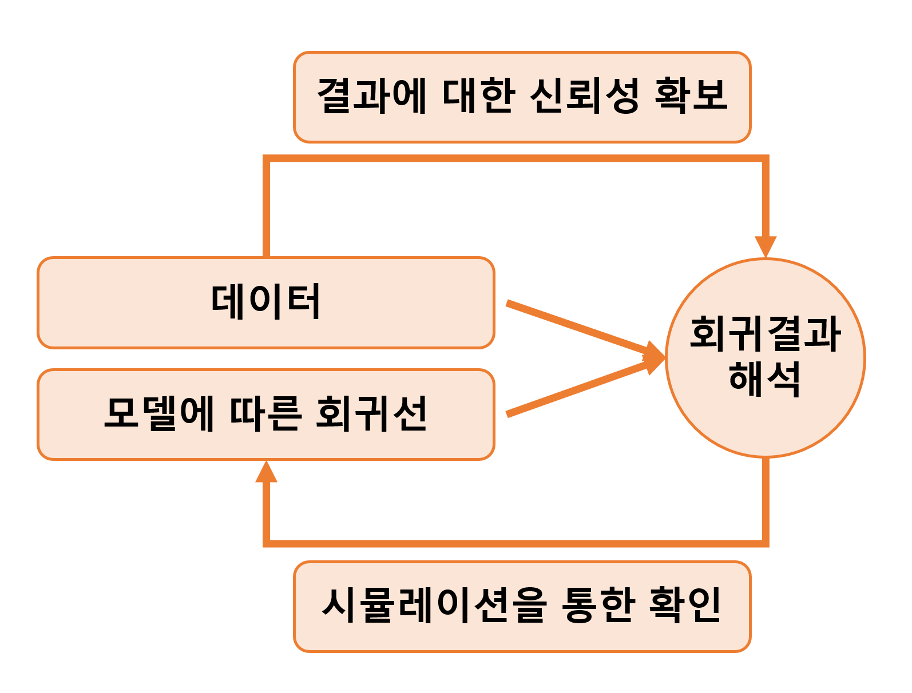

# Linear regression with a single predictor

회귀분석이란 본질적으로 주어진 설명변수들, $x_1, x_2, \dots, x_n$로부터 결과변수 $y$를 예측하는 기법이다. 이 챕터에서는 하나의 연속형 확률변수 $x$로 연속형 확률변수 $y$를 예측하는 선형모델 $y_i = a + bx_i + \text{error}$을 데이터 $(x_i, y_i), i=1, \cdots, n$에 적합하는 절차에 대해서 살펴본다.

```{r, echo = F, fig.width=7, fig.height=5.5}

```


## Example: predicting presidential vote share from the economy

Figure 7.1은 선거와 경제에 관한 에피소드를 보여준다. 정치학자 Douglas Hibbs가 경제성장 하나만 가지고 선거를 예측하고자 했던 "빵과 평화" 모델에 바탕을 둔 에피소드이다. 추가적인 정보가 더해진다면 더 나은 예측이 가능하겠지만 이 예제는 단순한 모델이 가지는 일종의 미학을 보여준다.

```{r, echo = F, fig.width=9, fig.height=5, fig.cap = "Douglas Hibbs’s “bread and peace” model of voting and the economy. Presidential elections since 1952 are listed in order of the economic performance at the end of the preceding administration (as measured by inflation-adjusted growth in average personal income). Matchups are listed as incumbent party’s candidate versus other party’s candidate. The better the economy was performing, the better the incumbent party’s candidate did, with the biggest exceptions being 1952 (Korean War) and 1968 (Vietnam War)."}
file_hibbs <- here::here("data/ros-master/ElectionsEconomy/data/hibbs.dat")
hibbs <- 
  file_hibbs %>% 
  read.table(header = TRUE) %>% 
  as_tibble()
hibbs %>% 
  mutate(
    label = str_glue("  {inc_party_candidate} vs. {other_candidate} ({year})  "),
    hjust = 
      if_else(
        year %in% c(1960, 1964, 1972, 1976, 1984, 1996, 2012),
        "right",
        "left"
      ),
    vjust =
      case_when(
        year == 1992 ~ 0,
        year == 2000 ~ 0.2,
        year %in% c(1960, 2008) ~ 1,
        TRUE ~ 0.5
      )
  ) %>% 
  ggplot(aes(growth, vote)) +
  geom_hline(yintercept = 50, color = "grey60") +
  geom_point() +
  geom_text(aes(label = label, hjust = hjust, vjust = vjust)) +
  scale_x_continuous(
    labels = scales::label_percent(accuracy = 1, scale = 1),
    expand = expansion(add = c(0.8, 1.2))
  ) +
  scale_y_continuous(labels = scales::label_percent(accuracy = 1, scale = 1)) +
  labs(
    title = "Forecasting elections from the economy",
    x = "Income growth",
    y = "Incumbent party's share of the popular vote"
  )

```

### Fitting a linear model to data

Figure 7.2는 경제와 선거 데이터를 예측의 문제로서 보여준다. 두 정당 중 집권당의 득표율을 `vote`로, 이전 연도의 개인의 평균 소득 성장을 `growth`로 코딩한 데이터이다.

```{r, fig.width=9, fig.height=4, fig.cap = "(a) Predicting elections from the economy: the data in Figure 7.1 expressed as a scatterplot, with one data point for each year, (b) the data with the linear fit, $y = 46.3 + 3.0x$. Repeated from Figure 1.1."}
hibbs %>% ggplot(aes(x = growth*0.01, y = vote*0.01, 
                     label = as.character(year))) + 
  #geom_point(shape = 21, size =3) + 
  labs(x = "Economic growth", 
       y = "Incumbent party's vote share",
       subtitle = "Forecasting the election from the economy") + 
  ggrepel::geom_text_repel() + 
  scale_x_continuous(labels=scales::percent_format(accuracy=1)) + 
  scale_y_continuous(labels=scales::percent_format(accuracy=1)) + 
  geom_hline(yintercept = 0.5, linetype='dotted') -> fig7.2a

model7.2 <- lm(I(vote*0.01) ~ I(growth*0.01), data = hibbs)
intercept <- coef(model7.2)[1]
slope <- coef(model7.2)[2]
hibbs %>% ggplot(aes(x = growth*0.01, y = vote*0.01, 
                     label = as.character(year))) + 
  geom_point(shape = 21, size =3) + 
  geom_abline(intercept = intercept, slope = slope) +  
  labs(x = "Economic growth", 
       y = "Incumbent party's vote share",
       subtitle = "Data and linear fit") + 
  scale_x_continuous(labels=scales::percent_format(accuracy=1)) + 
  scale_y_continuous(labels=scales::percent_format(accuracy=1)) + 
  geom_text(aes(x = 0.025, y = 0.53), label = "y = 46.4 + 3.0x") + 
  geom_hline(yintercept = 0.5, linetype='dotted') -> fig7.2b
library(patchwork)
fig7.2a + fig7.2b + plot_layout(ncol = 2)  
```

### Understanding the fitted model

`lm()` 함수로 추정한 모델의 결과는 다음과 같다:

```{r, echo = T}
summary(model7.2);
sigma(model7.2)
```

결과적으로 회귀선은 $y = 46.3 + 3.0x$로 표현할 수 있다.

  + $x=0$일 때(경제성장이 0일 때), 집권당의 후보는 약 46.3%의 득표율을 보일 것으로 예측된다(진다는 뜻; 50% 아래니까). 
  
    + 경제성장이 0이라는 얘기는 집권당이 형편없는 성과를 냈다는 뜻이므로 일종의 경제투표가 이루어졌다고 이해할 수 있다.
    
  + 0보다 큰 경제성장의 각 퍼센트마다 집권당의 기대득표율은 46.3%보다 3%p씩 높아진다. 
  
  + 계수에 대한 표준오차의 크기가 작다.
  
    + 일반적으로 절편값에 대한 표준오차는 크게 신경쓰지 않지만 기울기에 대한 표준오차는 추정값의 불확실성에 대한 측정지표이므로 중요하게 간주된다.
    
    + 계수값의 불확실성이 크다면, 표본을 새롭게 뽑을 때마다 그 결과가 크게 달라질 가능성이 크다는 것을 의미한다.

  + 추정된 잔차의 표준편차는 약 0.038로 이 선형 모델이 선겨 결과를 약 3.8%p 내에서 예측한다는 것을 의미한다.
  
    + 이는 모델을 통한 예측이 어느 정도 불확실성을 내포하고 있음을 의미한다.
  
### Graphing the fitted regression line

위의 Figure 7.2b와 같이 산포도와 함께 회귀선을 같이 보여줄 수 있다. `coef()` 함수는 선형모델의 추정된 계수값을 반환한다. 

### Using the model to predict

위의 모델을 가지고 2016년 민주당의 힐러리 클린턴과 공화당의 도널드 트럼프의 대선에 적용해볼 수 있다. 선형모델은 $46.3 + 3.0 * 2.0 = 52.3$을 예측한다. 이 예측된 득표율 하나 가지고는 힐러리가 2016년도에 이길 가능성이 얼마나 되는지를 예단하기 힘들다. 우리는 심지어 이 예측 결과에 있어서 존재할 수 있는 불확실성 또한 평가해야 한다.

Figure 7.3은 예측 결과가 52.3을 평균으로 하고 3.8을 표준편차로 하는 확률분포로부터 도출된 결과라는 것을 보여주고 이를 어떻게 이해하는 것이 바람직한지를 보여준다.

힐러리가 대중 투표에서 이길 확률을 추정하기 위해서 우리는 득표율에 대한 예측결과를 사용할 수 있다. 힐러리는 50% 이상의 표를 얻으면 승리한다. Figure 7.3에서 음영처리된 부분이 바로 그 확률을 보여준다. R에서도 주어진 통계치로 다음과 같이 확률을 구할 수 있다: `1 - pnorm(50, 52.3, 3.8)`. 결과인 0.72는 2016년 경제성장률이 2%라고 할 때, 힐러리가 대중투표에서 이길 확률이 약 72%라는 것을 의미한다.

```{r, fig.cap = "Forecast distribution for Hillary Clinton’s percentage of the two-party vote in 2016 based on an economic growth rate of 2%. The curve shows a normal distribution centered at the point forecast of $46.3 + 3.0 \times 2.0 = 52.3$ and with standard deviation of 3.9, the estimated uncertainty based on the model fit. The shaded area indicates the probability (based on the model) that Clinton wins, which is `1-pnorm(50, 52.3, 3.9)`, or 0.72."}
growth <- 2
model7.3 <- lm(vote ~ growth, data = hibbs)
vote_pred <- predict(model7.3, newdata = tibble(growth = growth))
sd <- sigma(model7.3)

tibble(
    vote = c(50, seq(vote_pred - 4 * sd, vote_pred + 4 * sd, 
                     length.out = 201)),
    y = dnorm(vote, mean = vote_pred, sd = sd)
  ) -> dt7.3

label <-
  str_glue(
    "Predicted\n",
    "{format(100 * (1 - pnorm(50, mean = vote_pred, sd = sd)), digits = 0)}% ",
    "chance\n",
    "of Clinton victory"
  )

dt7.3 %>% 
  ggplot(aes(vote, y)) +
  geom_area(data = . %>% filter(vote >= 50), fill = "grey70") +
  geom_line() +
  geom_segment(
    aes(x = 50, xend = 50, y = 0, yend = dnorm(50, mean = vote_pred, sd = sd))
  ) +
  annotate("text", x = 51.5, y = 0.025, label = label, hjust = 0) +
  scale_x_continuous(
    breaks = scales::breaks_width(5),
    labels = scales::label_percent(accuracy = 1, scale = 1)
  ) +
  scale_y_continuous(breaks = 0) +
  labs(
    title = "Probability forecast of Hillary Clinton vote share in 2016",
    subtitle = str_glue("Based upon {growth}% rate of economic growth"),
    x = "Clinton share of the two-party vote",
    y = NULL
  )
```

왜 우리는 직접적으로 경제 데이터를 이용해서 누가 선거에서 이길지를 예측하는 것이 아니라 간접적으로 주어진 데이터를 이용해 얼만큼 득표할지를 예측한 뒤, 그 득표값이 승리 득표값에 비해 클 확률을 계산하는, 복잡한 접근법을 취하는 것일까? 단순히 선거의 승리자를 예측하지 않는 이유는 다음과 같은 세 가지 종류의 선거를 고려하는 것으로 확인할 수 있다.

  + 1960년 Kennedy 대 Nixon의 선거와 같이 동등하게 나뉘어진 선거.
  
    + 이런 유형의 선거의 승자를 예측하고자 하는 것은 합당하지도, 의미가 있지도 않다.
    
    + 가장 최선의 방법은 실제 선거에서 나타날 득표율에 가장 가까운 결과를 예측하는 것이다.
    
  + 2008년 Obama 대 McCain의 선거와 같이 어느 정도 경쟁적인 선거.
  
    + 한 쪽이 승리할 것으로 예측되지만, 다른 한 쪽이 뒤집을 수도 있는 경우.
    
    + 이 경우, 어떤 한 쪽이 승리할 것이라는 결정주의적인 선언을 하기보다는 득표 범위(vote margin)와 후보의 승리확률을 예측하게 된다.
    
  + 1984년 Reagan 대 Mondale 선거와 같이 한 쪽이 일방적으로 승리하는 선거.
  
    + 승자를 예측하는 것에 아무런 의미가 없다. 얼마나 정확하게 예측하는지는 살펴볼만하다.
    
이 파트를 읽으면서 느낀 점은, 선거는 어떻게 예측하던 앞으로 비슷한 선거에서 참고할만한 시나리오를 만드는 작업으로 귀결되기 마련이라는 것이다. 특정한 시나리오가 맞아 떨어졌다고 해서 그것이 완벽한 예측을 한 것이라 보기는 힘들고, 완전히 다른 예측을 했다고 해서 쓸모없는 시나리오는 아니라는 것이다.

## Checking the model-fitting procedure using fake-data simulation

우리가 사실이라고 알고 있는 조건들을 통제하는 상황에서 회귀모델을 수행하는 예제를 통해 적합 결과를 확인할 수 있다.

### Step 1: Creating the pretend world

모델의 모든 파라미터에 대한 값들이 진실값(true values)이라고 가정하는 것에서 시작하자. $y = 46.3 + 3.0x + \text{error}$라는 관계가 참이며, 오차는 평균 0, 표준편차 3.8을 가진 정규분포를 따른다고 가정하자. 이제 모델을 통해 얻은 $y$의 분포가 실제 관측된 $y$의 분포와 일관된지를 분석할 수 있게 된다.

```{r, echo=T}
a <- 46.3
b <- 3.0
sigma <- 3.8
x <- hibbs$growth
n <- length(x)
```


### Step 2: Simulating fake data

페이크데이터의 벡터 $y$를 시뮬레이션하고 데이터프레임으로 만들어 보자:

```{r, echo = T}
y <- a + b*x + rnorm(n, 0, sigma)
fake <- data.frame(x, y)
```

### Step 3: Fitting the model and comparing fitted to assumed values

다음 단계는 데이터에 회귀모델을 적합하는 것이다. 회귀모델 적합은 $\alpha, \beta, \sigma$로 가정한 진실값들을 사용하지 않는다.

```{r, echo = T}
fit7.4 <- lm(y ~ x, data = fake)
summary(fit7.4)
```

추정된 계수값을 가정한 진실값, 46.3과 3.0과 비교해면, 적합된 결과가 충분히 합당하다는 것을 할 수 있다. 추정값은 정확하게 들어맞지는 않지만 오차 범위 내에 존재한다.

회귀분석 결과 객체로부터 계수값에 대한 추정값과 표준오차를 추출해서 비교해보도록 한다.

```{r, echo = T}
b_hat <- summary(fit7.4)$coef[2,1] 
b_se  <- summary(fit7.4)$coef[2,2] 
```

모수의 진실값 $b$가 각각 $\pm1$이나 $\pm2$의 표준오차로 추정된 68%와 95%의 신뢰구간 내에서 얻을 수 있는지를 확인해보자 (Figure 4.1을 생각해보자):

```{r, echo = T}
cover_68 <- abs(b - b_hat) < b_se
cover_95 <- abs(b - b_hat) < 2*b_se
cat(paste("68% coverage: ", cover_68, "\n"))
cat(paste("95% coverage: ", cover_95, "\n"))
```

### Step 4: Embedding the simulation in a loop

신뢰구간이 모수의 진실값을 포함하는가? 이를 확인하기 위해서 정규분포를 사용, 우리는 표집분포를 1000회의 반복문을 통해서 데이터 시뮬레이션, 모델 적합, 그리고 신뢰구간의 범주가 모집단을 포함하는지를 컴퓨팅해서 체크할 수 있다. 

```{r, echo = T}
n_fake <- 1000
cover_68 <- rep(NA, n_fake)
cover_95 <- rep(NA, n_fake)
for (s in 1:n_fake){
  y <- a + b*x + rnorm(n, 0, sigma)
  fake <- data.frame(x, y)
  fit7.4 <- lm(y ~ x, data=fake)
  b_hat <- summary(fit7.4)$coef[2,1] 
  b_se  <- summary(fit7.4)$coef[2,2] 
  cover_68[s] <- abs(b - b_hat) < b_se
  cover_95[s] <- abs(b - b_hat) < 2*b_se
}
cat(paste("68% coverage: ", mean(cover_68), "\n"))
cat(paste("95% coverage: ", mean(cover_95), "\n"))
```

이 결과는 `mean(cover_68) =` 67%, `mean(cover_95) =` 92%로 각 68%, 95%에서 멀리 떨어져 있지 않다는 것을 알 수 있다. 좀 차이가 나는 이유는 표본 규모가 작기 때문이다. 표본 규모를 반영한 자유도 14의 $t$ 분포를 고려해서 추정해보자.

```{r, echo = T}
n_fake <- 1000
cover_68 <- rep(NA, n_fake)
cover_95 <- rep(NA, n_fake)
t_68 <- qt(0.84, n - 2)
t_95 <- qt(0.975, n - 2)
for (s in 1:n_fake){
  y <- a + b*x + rnorm(n, 0, sigma)
  fake <- data.frame(x, y)
  fit <- lm(y ~ x, data=fake)
  b_hat <- summary(fit7.4)$coef[2,1] 
  b_se  <- summary(fit7.4)$coef[2,2] 
  cover_68[s] <- abs(b - b_hat) < t_68 * b_se
  cover_95[s] <- abs(b - b_hat) < t_95 * b_se
  }
cat(paste("68% coverage: ", mean(cover_68), "\n"))
cat(paste("95% coverage: ", mean(cover_95), "\n"))
```

위의 시뮬레이션 결과는 95% 신뢰구간이 모수의 진리값을 포함하고 있다(`TRUE`)는 결과를 반환한다.

## Formulating comparisons as regression models

회귀분석으로 비교하기 위해서는 더미변수(dummy variable)[^7-1]의 개념이 필요하다. 더미변수는 어떤 데이터가 특정한 카테고리에 속하냐 속하지 않느냐에 따라 1 또는 0으로 나타내는 예측변수를 의미한다.

### Estimating the mean is the same as regressing on a constant term

평균이 2.0, 표준편차가 5.0인 모집단으로부터 20개의 관측치를 시뮬레이션해보자. 소수점 둘째자리로 반올림한 시뮬레이션 결과는 다음과 같다:

```{r, echo = T}
n_0 <- 20
y_0 <- rnorm(n_0, 2.0, 5.0)
fake_0 <- data.frame(y_0)
print(round(y_0, 2))
```

무작위 표본이라는 것을 고려하면 모집단의 평균을 `mean(y_0)`, 표준오차를 `sd(y_0)/sqrt(n_0)`으로 추정할 수 있다.

```{r, echo = T}
mean(y_0); #2.3
sd(y_0)/sqrt(n_0) # 1.07
```

절편에 대한 최소자승 회귀분석을 이용하여 동일한 결과를 얻을 수도 있다.

```{r, echo = T}
fit7.5 <- lm(y_0 ~ 1, data=fake_0)
summary(fit7.5);sigma(fit7.5)
```

모수로서 절편이 2.0, 잔차의 표준편차인 $\sigma$가 5.0이라는 것을 아는 상태에서 시뮬레이션을 했지만 작은 표본 규모는 불확실한 추정값(noisy estimates)을 산출한다. 추정값 2.35$(\beta)$, 4.78$(\sigma)$는 주어진 표준오차 하에서 모수값을 포함한다는 것을 알 수 있다.

### Estimating a difference is the same as regressing on an indicator variable

이번에는 새로운 그룹을 추가한다. 평균 8.0, 표준편차 5.0인 모집단으로부터 30개의 관측치를 추출한 집단이다.

```{r, echo = T}
n_1 <- 30
y_1 <- rnorm(n_1, 8.0, 5.0)
```

각 집단의 평균을 직접 비교하고 표준오차도 컴퓨팅 할 수 있다:

```{r, echo = T}
diff <- mean(y_1) - mean(y_0)
se_0 <- sd(y_0)/sqrt(n_0)
se_1 <- sd(y_1)/sqrt(n_1)
se <- sqrt(se_0^2 + se_1^2)
```

시뮬레이션에 있어서 두 집단의 평균 차이는 6.13, 그 평균 차이의 표준오차는 1.12이다. 이 결과는 실제 모집단에서의 평균 차이인 6.0에 근접한 것이다.

데이터로부터 $y$라는 하나의 벡터와 더미변수 $x$를 합쳐서 회귀분석 프레임으로 재구성할 수 있다. 이때, 더미변수 $x$는 집단 0에 관측치가 속할 경우에 0, 집단 1에 관측치가 속할 때는 1로 코딩되어 있는 변수이다.

$$
x_i = 
\begin{cases}
  0 & \text{if observation $i$ is in group 0}\\
  1 & \text{if observation $i$ is in group 1}.
\end{cases}       
$$

R로 나타내면:

```{r, echo = T}
n <- n_0 + n_1
y <- c(y_0, y_1)
x <- c(rep(0, n_0), rep(1, n_1))
fake <- data.frame(x, y)
fit7.6 <- lm(y ~ x, data=fake)
summary(fit7.6);sigma(fit7.6)
```

추정된 기울기는 6.13으로 앞에서 살펴본 $\bar y_1 - \bar y_0$의 차이와 동일하다. 표준오차도 거의 동일하지만 약간 다른데, 왜냐하면 두 평균 차이와 각각의 표준오차를 직접 구해서 비교할 경우 $se_0$과 $se_1$이라는 별개의 값을 활용해서 계산을 하는 반면, 회귀모델은 하나의 잔차의 표준오차 모수값을 추정하기 때문이다.[^7-2]

Figure 7.4는 앞서 두 집단에 대한 추정치의 차이를 시각적으로 보여준다. 다른 예측변수들이 없을 때, 최소자승 회귀선은 $(0, \bar y_0)$와 $(1, \bar y_1)$의 두 점을 지난다. 회귀선의 기울기는 $\bar y_1 - \bar_0$의 차이를 보여준다.

이 챕터의 페이크데이터 시뮬레이션은 다음과 같은 내용을 보여준다:

  1. 직접 비교와 회귀분석의 결과가 동일한지 여부를 직접적으로 확인할 수 있다.
  
  2. 통계적 적합의 특성을 이해할 수 있도록 한다.


```{r, echo = F, fig.width=7, fig.height=5, fig.cap="Simulated-data example showing how regression on an indicator variable is the same as computing the difference in means between two groups."}
set.seed(1224)
n_0 <- 200
y_0 <- rnorm(n_0, mean = 2, sd = 5)
y_0_mean <- mean(y_0)
y_0_mean_se <- sd(y_0) / sqrt(n_0)
data_2 <- tibble(y = y_0)

fit_7.4_2 <- 
  lm(y ~ 1, data = data_2)
n_1 <- 300
y_1 <- rnorm(n_1, mean = 8, sd = 5)
y_1_mean <- mean(y_1)
y_1_mean_se <- sd(y_1) / sqrt(n_1)

diff <- y_1_mean - y_0_mean
diff_se <- sqrt(y_0_mean_se^2 + y_1_mean_se^2)

data_3 <- 
  bind_rows(
    tibble(x = 0, y = y_0),
    tibble(x = 1, y = y_1)
  )

fit_7.4_3 <- 
  lm(y ~ x, data = data_3)

label_y_0_mean <- 
  str_glue("bar(y)[0] == {format(y_0_mean, digits = 2, nsmall = 2)}")
label_y_1_mean <- 
  str_glue("bar(y)[1] == {format(y_1_mean, digits = 2, nsmall = 2)}")

intercept <- coef(fit_7.4_3)[["(Intercept)"]]
slope <- coef(fit_7.4_3)[["x"]]

eqn <- 
  str_glue(
    "y = {format(intercept, digits = 2, nsmall = 2)} + ",
    "{format(slope, digits = 2, nsmall = 2)} x"
  )

offset <- 1.5

data_3 %>% 
  ggplot(aes(x, y)) +
  geom_hline(yintercept = c(y_0_mean, y_1_mean), 
             linetype = "dashed",
             color = "grey60") +
  geom_abline(slope = slope, intercept = intercept) +
  geom_point(alpha = 0.25) +
  annotate(
    "text",
    x = c(0.04, 0.96),
    y = c(y_0_mean - offset, y_1_mean + offset),
    hjust = c(0, 1),
    label = c(label_y_0_mean, label_y_1_mean),
    parse = TRUE
  ) +
  annotate(
    "text",
    x = 0.5,
    y = intercept + slope * 0.5 - offset,
    hjust = 0,
    label = eqn
  ) +
  scale_x_continuous(breaks = 0:1, minor_breaks = NULL) +
  labs(
    subtitle =
      "Regression on an indicator is the same as computing a difference in means",
    x = "Indicator, x"
  )

```

[^7-1]: @ghv2020[99]는 지시변수(indicator variable)이라는 용어를 사용한다.
[^7-2]: 각 집단 간의 표본 크기가 다를 수 있어서 각 집단의 표준오차를 따로 구해서 그 차이의 표준오차를 구할 때와 회귀모델로 하나의 모델에서 잔차의 표준오차 하나를 추정할 때와 차이가 나타날 수 있다.
