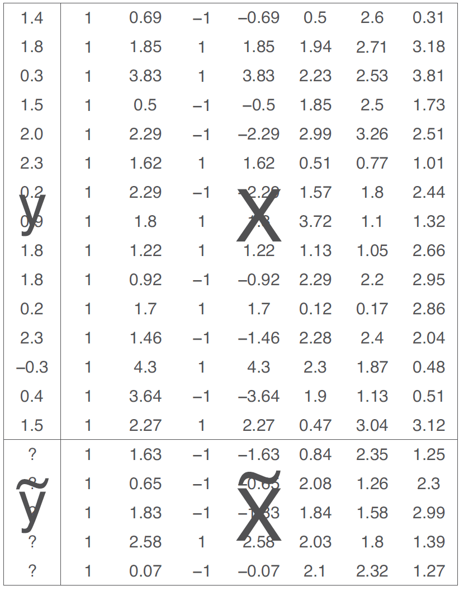

# Linear regression with multiple predictors

단순한 모델, $y = a + bx + \text{error}$로부터 좀 더 일반적인 모델, $y = \beta_0 + \beta_1x_1 + \beta_2x_2 + \cdots + \text{error}$로 넘어가게 되면, 모델에 어떤 예측변수, $x$를 포함할 것인가, 계수값에 대한 해석을 어떻게 할 것인가, 그 결과들이 어떻게 상호작용하며 이산성(discreteness)와 비선형성(nonlinearity)을 보여주는 기존 변수로부터 새로운 예측변수를 어떻게 구성할 것인지 등을 고려해야 한다.

## Adding predictors to a model

회귀계수는 통상적으로 여러 개의 예측변수를 해석하는 것이 더 까다롭다. 왜냐하면 주어진 계수값은 어디까지나 모델 내 다른 변수들의 영향력을 고려한 부분적인 결과물이기 때문이다.

  + 계수 $\beta_k$는 다른 모든 예측변수들이 동일할 때, 예측변수 $x_k$의 한 단위 변화가 나타난 두 사람을 비교했을 때의 결과 $y_k$의 평균 혹은 기대값의 차이라고 할 수 있다.

  + 성인 미국 여성과 아이들에 대한 설문조사로부터 얻은 데이터를 통해 어머니의 특성들이 조건주어졌을 때, 미취학 아동들의 인지시험성적을 예측하기 위한 일련의 회귀모델들을 적합해본다고 하자.

```{r, echo = T}
file_kids <- here::here("data/ros-master/KidIQ/data/kidiq.csv") 
kidiq <- read_csv(file_kids)
```

### Starting with a binary predictor

엄마가 고등학교를 졸업했냐 하지 못했냐를 보여주는 더미변수가 주어졌을 때, 아이들의 시험 성적을 모델링해보자.

```{r, echo = T}
fit_1 <- stan_glm(kid_score ~ mom_hs, 
         data=kidiq, refresh = 0)
print(fit_1)
```

위의 코드는 다음과 같이 쓸 수 있다.

$$
\text{kid_score} = 78 + 12 \times \text{mom_hs} + \text{error}.
$$

이 모델은 엄마가 고등학교를 졸업한 아이들과 그렇지 않은 아이들 간의 평균 시험 성적의 차이를 보여준다. Figure 10.1은 그 회귀선이 두 집단의 평균을 지나가는지를 보여준다.

```{r, fig.cap = "Child’s test score plotted versus an indicator for whether mother completed high school. Superimposed is the regression line, which runs through the average of each subpopulation defined by maternal education level. The indicator variable for high school completion has been jittered; that is, a random number has been added to each x-value so that the points do not lie on top of each other."}
intercept <- coef(fit_1)[["(Intercept)"]]
slope <- coef(fit_1)[["mom_hs"]]

kids %>% 
  ggplot(aes(mom_hs, kid_score)) +
  geom_jitter(alpha = 1/4, width = 0.025) +
  geom_abline(slope = slope, intercept = intercept) +
  scale_x_continuous(
    breaks = 0:1,
    minor_breaks = NULL,
    labels = c("No", "Yes")
  ) +
  scale_y_continuous(breaks = scales::breaks_width(20)) +
  labs(
    title = "Child test score vs. mother high school completion",
    x = "Mother completed high school",
    y = "Child test score",
    size = "Count"
  )
```

### A single continuous predictor

만약 더미변수가 아니라 연속형 변수, 엄마의 IQ 점수를 예측변수로 모델에 포함하였다면, 이는 다음과 같이 다시 쓸 수 있다.

$$
\text{kid_score} = 26 + 0.6\times \text{mom_iq} + \text{error}.
$$

이 모델을 시각화하면 Figure 10.2처럼 나타낼 수 있다. Figure 10.2의 선은 엄마의 IQ 수준의 각 관측치에 따른 아이들의 예측된 인지성적을 보여준다고 이해할 수 있다.

  + 만약 우리가 엄마의 IQ가 1점 다른 두 집단에서의 아이들의 인지성적 점수의 평균을 비교한다면, 엄마의 IQ가 더 높은 집단의 아이들이 평균적으로 0.6 높은 인지성적 수준을 보여줄 것이다.
  
  + 그리고 여기에서 절편-상수항을 이해하려면, 모든 예측변수들이 0인 상황을 가정해야 한다.

```{r, fig.cap = "Child’s test score plotted versus maternal IQ with regression line superimposed. Each point on the line can be conceived of either as a predicted child test score for children  with mothers who have the corresponding IQ, or as the average score for a subpopulation of children with mothers with that IQ." }
fit_2 <- stan_glm(kid_score ~ mom_iq, data = kids, refresh = 0)
intercept <- coef(fit_2)[["(Intercept)"]]
slope <- coef(fit_2)[["mom_iq"]]

kids %>% 
  ggplot(aes(mom_iq, kid_score)) +
  geom_point(alpha = 2/3) +
  geom_abline(slope = slope, intercept = intercept) +
  scale_x_continuous(breaks = scales::breaks_width(10)) +
  scale_y_continuous(breaks = scales::breaks_width(20)) +
  labs(
    title = "Child test score vs. mother IQ score",
    x = "Mother IQ score",
    y = "Child test score"
  )
```

### Including both predictors

이번에는 두 개의 예측변수로 아이의 시험 성적을 예측하는 선형회귀모델을 고려해보자. 이 모델은 다음과 같이 나타낼 수 있다.

$$
\text{kid_score} = 26 + 6.0 \times \text{mom_hs} +  0.6\times \text{mom_iq} +  \text{error}.
$$

```{r, echo = T}
fit_3 <- stan_glm(kid_score ~ mom_hs + mom_iq, 
                  data=kidiq, refresh = 0)
print(fit_3)
```

### Understanding the fitted model

```{r, fig.cap = "Child’s test score plotted versus maternal IQ. Light dots represent children whose mothers graduated from high school and dark dots represent children whose mothers did not graduate from high school. Superimposed are the lines from the regression of child’s test score on maternal IQ and maternal high school indicator (the darker line for children whose mothers did not complete high school, the lighter line for children whose mothers did complete high school)."}
lines <- 
  tribble(
    ~mom_hs, ~intercept, ~slope,
    0, coef(fit_3)[["(Intercept)"]], coef(fit_3)[["mom_iq"]],
    1, 
      coef(fit_3)[["(Intercept)"]] + coef(fit_3)[["mom_hs"]],
      coef(fit_3)[["mom_iq"]]
  )

kids %>% 
  ggplot(aes(mom_iq, kid_score, color = factor(mom_hs))) +
  geom_point() +
  geom_abline(
    aes(slope = slope, intercept = intercept, color = factor(mom_hs)),
    data = lines
  ) +
  scale_x_continuous(breaks = scales::breaks_width(10)) +
  scale_y_continuous(breaks = scales::breaks_width(20)) +
  scale_color_discrete(breaks = 0:1, labels = c("No", "Yes")) +
  theme(legend.position = "bottom") +
  labs(
    title = "Child test score vs. mother IQ score and high school completion",
    subtitle = "Without interaction",
    x = "Mother IQ score",
    y = "Child test score",
    color = "Mother completed high school"
  )
```

엄마의 IQ 성적이 아이들의 인지시험 성적에 미치는 효과-회귀모델의 기울기는 엄마의 교육 수준에 따라 나뉜 두 집단에 따라 동일하다. 뒤에 이어지는 Section 10.3에서는 두 선의 기울기가 달라질 수 있는 상호작용 모델을 고려해볼 것이다. 일단 여기서 모델을 해석하자면 다음과 같다.

  + 절편: 만약 아이가 IQ가 0인 엄마를 가지고 있고 또한 그 엄마가 고등학교를 졸업하지 않았다면, 아이의 인지시험 성적은 26점일 것이라고 예측된다.
  
    + 하지만 이 예측은 유용하지 않다. 왜냐하면 현실적으로 쉽게 찾아보기 힘든 경우이기 때문이다.
    
  + 엄마의 고등학교 졸업에 대한 계수: 동일한 IQ의 엄마를 가졌지만 한 쪽은 고등학교를 졸업, 다른 한 쪽은 졸업하지 않은 두 아이가 있다고 할 때, 모델은 이 두 아이의 인지성적 차이가 6점일 것으로 예측한다.

  + 엄마의 IQ에 대한 계수: 엄마의 고등학교 졸업 여부가 같을 때, 엄마의 IQ 수준이 1점 차이가 날 때, 아이의 시험 성적은 평균적으로 0.6점 차이가 난다고 예측한다.

## Interpreting regression coefficients

### It’s not always possible to change one predictor while holding all others constant

우리는 다른 예측변수가 동일한 수준으로 고정되어 있을 때, 한 예측변수의 변화에 따른 개인들의 결과변수를 비교하는 것으로 회귀계수를 해석한다.

### Counterfactual and predictive interpretations

다중선형회귀모델에서 어떻게 계수값을 해석할 것인지를 생각해볼 때, 우리는 회귀계수에 대한 해석 방식을 두 가지로 구분한다.

  + 예측적 해석(predictive interpretation)
  
    + 다른 모든 예측변수들이 동일할 때, 특정 예측변수의 한 단위 변화가 서로 다른 두 집단의 결과변수에 있어서 평균적으로 어떠한 차이를 가져오는지에 초점을 맞추어 해석한다.
    
    + 선형모델에서 계수값은 두 관측치에 있어서 $y$의 기대값의 차이라고 이해할 수 있다.
  
  + 반사실적 해석(counterfactual interpretation)
  
    + 개인들 간의 비교라기보다는 개인들 내의 변화로 이해할 수 있다.
    
    + 모델에서 다른 예측변수들이 변화하지 않을 때, 한 예측변수의 한 단위 변화가 $y$에 가져오는 기대값의 변화로 이해하는 것이다.

  + 하지만 명확하게 말하면 데이터만 가지고는 회귀모델은 오직 단위 간의 비교만을 말할 수 있을 뿐, 단위 내의 변화에 대해서는 구분할 수 없다.
  
    + 따라서 비교의 맥락에서 회귀계수를 해석하는 것이 더 안전한 방법이라고 할 수 있다.

## Interactions

앞서서는 엄마의 IQ 점수와 고등학교 졸업 유무가 서로 독립적으로 아이의 시험성적에 영향을 미치는 것으로 모델링되었다면, 이번에는 그 둘이 서로 상호작용하는, 그래서 기울기가 실질적으로 다르게 나타나는 경우를 살펴본다: `mom_hs`와 `mom_iq` 간의 상호작용항을 포함하는 것이다.

```{r, echo = T}
fit_4 <- stan_glm(kid_score ~ mom_hs + mom_iq + 
                    mom_hs:mom_iq, data=kidiq,
                  refresh = 0)
print(fit_4)
```

이러한 상호작용을 포함한 모델은 주효과(main effects)와 그 상호작용 효과, `mom_hs:mom_iq`을 포함하고, 다음과 같이 나타낼 수 있다.

$$
\text{kid_score} = −11 + 51 \times \text{mom_hs} + 1.1 \times \text{mom_iq} − 0.5 \times \text{mom_hs}\times \text{mom_iq} + \text{error},
$$

Figure 10.4a와 같이 엄마의 교육 수준에 따라 정의되는 하위 집단으로 회귀선을 각기 추정할 수 있다. 한편 Figure 10.4b는 절편을 보여주는 $x$ 축이 0까지 확장된 그래프이다.

```{r, fig.width=9, fig.height=4, fig.cap="(a) Regression lines of child’s test score on mother’s IQ with different symbols for children of mothers who completed high school (light circles) and those whose mothers did not complete high school (dark dots). The interaction allows for a different slope in each group, with light and dark lines corresponding to the light and dark points. (b) Same plot but with horizontal and vertical axes extended to zero to reveal the intercepts."}
lines <- 
  tribble(
    ~mom_hs, ~intercept, ~slope,
    0, coef(fit_4)[["(Intercept)"]], coef(fit_4)[["mom_iq"]],
    1, 
      coef(fit_4)[["(Intercept)"]] + coef(fit_4)[["mom_hs"]],
      coef(fit_4)[["mom_iq"]] + coef(fit_4)[["mom_hs:mom_iq"]]
  )

kids %>% 
  ggplot(aes(mom_iq, kid_score, color = factor(mom_hs))) +
  geom_point() +
  geom_abline(
    aes(slope = slope, intercept = intercept, color = factor(mom_hs)),
    data = lines
  ) +
  scale_x_continuous(breaks = scales::breaks_width(10)) +
  scale_y_continuous(breaks = scales::breaks_width(20)) +
  scale_color_discrete(breaks = 0:1, labels = c("No", "Yes")) +
  theme(legend.position = "bottom") +
  labs(
    title = "Child test score vs. mother IQ score and high school completion",
    subtitle = "With interaction",
    x = "Mother IQ score",
    y = "Child test score",
    color = "Mother completed high school"
  )+ theme(plot.title = element_text(size = 10),
            plot.subtitle = element_text(size = 9)) -> 
  fig10.4a

kids %>% 
  ggplot(aes(mom_iq, kid_score, color = factor(mom_hs))) +
  geom_point(size = 0.75) +
  geom_abline(
    aes(slope = slope, intercept = intercept, color = factor(mom_hs)),
    data = lines
  ) +
  coord_cartesian(xlim = c(0, NA), ylim = c(-20, NA)) +
  scale_x_continuous(breaks = scales::breaks_width(10)) +
  scale_y_continuous(breaks = scales::breaks_width(20)) +
  scale_color_discrete(breaks = 0:1, labels = c("No", "Yes")) +
  theme(legend.position = "bottom") +
  labs(
    title = "Child test score vs. mother IQ score and high school completion",
    subtitle = "With interaction",
    x = "Mother IQ score",
    y = "Child test score",
    color = "Mother completed high school"
  ) + theme(plot.title = element_text(size = 10),
            plot.subtitle = element_text(size = 9)) -> fig10.4b

fig10.4a + fig10.4b
```

상호작용 모델의 경우에는 계수값 해석에 주의를 기울여야 한다. 특정한 하부집단 내/간(within/across) 평균 또는 예측된 시험 성적을 분석함으로써 우리는 적합한 모델로부터 함의를 이끌어낼 수 있다.

  + 절편: 엄마가 고등학교를 마치지 못했거나 IQ가 0인, 현실적으로 의미없는 시나리오의 경우에 아이들의 예측된 시험 성적을 보여준다.
  
  + `mom_hs`에 대한 계수: 엄마가 고등학교를 마치지 못했고 IQ가 0인 엄마를 가진 아이들과 고등학교는 마쳤지만 IQ 수준이 0인 엄마를 가진 아이들 간 인지시험 성적의 예측값의 차이라고 할 수 있다.
  
    + 보통 IQ 수준이 0인 경우를 상정할 수 없기 때문에 쉽게 해석하기는 어렵다.
  
  + `mom_iq`에 대한 계수: 엄마가 고등학교를 마치지 못했던 아이와 고등학교를 마친 엄마를 가진 아이 간에 IQ 성적 1점 차이가 아이의 인지시험 성적 평균의 차이에 있어서 얼마만큼의 변화를 가지고 오는지를 보여준다.

  + 상호작용항에 대한 계수: 엄마가 고등학교를 마치거나 마치지 못한 아이들 간의 `mon_iq`에 대한 기울기의 차이를 보여준다.
  
    + 즉, Figure 10.4에서 두 기울기의 차이를 의미한다.

고등학교를 마친 엄마와 그렇지 못한 엄마를 가진 아이들 각각에 대해 별도의 회귀선을 수식으로 살펴보면 다음과 같다.

$$
\begin{aligned}
\text{mom_has = 0}:\:\text{kid_score}&=-11+51\times0+1.1\times\text{mom_iq}-0.5\times0\times\text{mom_iq}\\
&=-11+1.1\times\text{mom_iq}\\
\text{mom_has = 1}:\:\text{kid_score}&=-11+51\times1+1.1\times\text{mom_iq}-0.5\times1\times\text{mom_iq}\\
&=40+0.6\times\text{mom_iq}\\
\end{aligned}
$$

고등학교를 마치지 못한 엄마를 가진 아이들에 대한 추정된 기울기 1.1과 고등학교를 마친 엄마를 가진 아이들에 대한 추정된 기울기 0.6은 직접적으로 해석이 가능하다.

### When should we look for interactions?

상호작용은 중요할 수 있다. 우리는 대개 상호작용을 포함하지 않았을 때, 예측변수들의 계수갑싱 매우 크게 나타날 경우에 상호작용이 존재할지 탐색한다.

상호작용을 포함하는 것은 모델을 또 다른 데이터의 서브셋을 이용해 적합하는 것과 같다. 여기서 두 가지 접근법이 이따: 서로 구별되는 집단에 대해 별도로 모델을 적합하거나 혹은 전체 표본을 대상으로 상호작용을 고려한 모델을 적합하는 것이다.

### Interpreting regression coefficients in the presence of interactions

우리는 각 예측변수들을 평균 혹은 용이한 기준점을 가지고 중심화(centering)함으로써 상호작용항을 가진 모델을 보다 쉽게 해석할 수 있게 된다.

## Indicator variables

더미변수가 회귀모델에 포함되어 있을 때의 비교를 한 번 살펴보자. 설문 자료에 바탕을 두고 있을 때, 몸무게와 다른 변수들을 가지고 그 사람의 키를 예측하고자 하는 모델이 있다고 하자. 일단 데이터를 살펴보자.

```{r, echo = T}
earnings %>% head(n = 10)
```

일단 몸무게(파운드)로 키(인치)를 예측해보자.

```{r, echo = T}
fit_1 <- stan_glm(weight ~ height, 
                  data = earnings, refresh = 0)
print(fit_1)
```

적합된 회귀선은 다음과 같이 나타낼 수 있다: $\text{weight} = -172.9 + 4.9 \times \text{hegiht}$.

  + 키가 1인치 다른 두 사람을 비교했을 때, 그들의 몸무게의 기대된 차이(expected difference)는 4.9 파운드이다.
  
  + 키가 0인치 인 사람의 몸무게 예측값은 -172.9 파운드이다. 하지만 큰 의미는 없는 값이다. 왜냐하면 실제로 키가 0인 사람은 없기 때문이다. 따라서 미국 성인의 평균 키가 66인치라고 할 때의 몸무게의 예측값을 구해보자: $-172.9 + 4.9 \times 66$.
  
```{r, echo = T}
# one-way
coefs_1 <- coef(fit_1)
predicted_1 <- coefs_1[1] + coefs_1[2]*66

# another way
new <- data.frame(height=66)
pred <- posterior_predict(fit_1, newdata=new)
```

다음과 같은 결과를 얻을 수 있다.

```{r, echo = T}
cat("Predicted weight for a 66-inch-tall person is",
    round(mean(pred)),
    "pounds with a sd of", round(sd(pred)), "\n")
```

### Centering a predictor

적합된 모델의 더 나은 해석을 위해서 키를 중심화한 변수를 예측변수로 사용해보았다.

```{r, echo=T}
earnings$c_height <- earnings$height - 66
fit_2 <- stan_glm(weight ~ c_height, 
                  data=earnings, refresh = 0)
print(fit_2)
```

### Including a binary variable in a regression

이번에는 성별에 관한 더미변수를 포함해보자.

```{r, echo = T}
fit_3 <- stan_glm(weight ~ c_height + male,
                  data=earnings, refresh = 0)
print(fit_3)
```

남성일 경우의 계수값 12.0은 이 데이터에서 동일한 키를 가진 여성에 비교했을 때 남성이 12파운드 더 무거울 것이라고 예측된다는 것과 같은 의미를 가진다. 70인치의 키를 가진 여성의 예측된 몸무게를 컴퓨팅하는 것도 같은 방식으로 할 수 있다.

```{r, echo = T}
# one-way
coefs_3 <- coef(fit_3)
predicted <- coefs_3[1] + coefs_3[2]*4.0 + coefs_3[3]*0

# another way
new <- data.frame(c_height=4.0, male=0)
pred <- posterior_predict(fit_3, newdata=new)
```

그 결과는 다음과 같다:

```{r, echo = T}
cat("Predicted weight for a 70-inch-tall woman is",
    round(mean(pred)),
    "pounds with a sd of", round(sd(pred)), "\n")
```

70인치의 남성의 몸무게에 대한 예측값은 `mean(posterior_predict(fit_3, newdata = data.frame(c_height = 4.0, male = 1)))`로, 177파운드라는 결과이며 같은 키를 가진 여성에 비해 12 파운드 더 무거운 결과이다.

### Using indicator variables for multiple levels of a categorical predictor

회귀모델에 인종을 포함해보자. 인종은 네 가지 그룹으로 이루어져 있다.

```{r, echo = T}
table(earnings$ethnicity) %>% knitr::kable()
```

우리는 회귀모델에서 인종을 일종의 요인(factor)으로 포함한다.

```{r, echo = T}
fit_4 <- stan_glm(weight ~ c_height + male + 
                    factor(ethnicity), 
                  data=earnings, refresh = 0)
print(fit_4)
```

인종은 모두 네 가지 수준으로 측정되어 있다. 그런데 분석 결과를 보면 3개의 계수값만이 나타난다. 추정되지 않은 집단은 흑인(Blacks)이다. `Black`은 기준카테고리로 취급되어 다른 변수들의 비교 대상일 뿐이기에 계수가 추정되지 않은 것이다. 

따라서 히스패닉에 대한 계수값, -5.9는 동일한 키와 성별을 가진 흑인에 비교할 때, 히스패닉이 몸무게가 평균적으로 5.9파운드 덜 나간다는 것을 의미한다.

### Changing the baseline factor level

회귀모델의 요인변수는 카테고리 중 어떤 것이든 원하는 것을 기준변수로 삼을 수 있다. R은 알파벳 순서에 따라 기준변수를 삼는다.

```{r, echo = T}
earnings$eth <- factor(earnings$ethnicity,
                       levels=c("White", "Black", 
                                "Hispanic", "Other"))
fit_5 <- stan_glm(weight ~ c_height + male + eth, 
                  data=earnings, refresh = 0)
print(fit_5)
```

변수의 순서를 조정하면 `White`가 기준 카테고리가 된다.

  + 절편값 154.1은 `c_height = 0, male = 0, ethnicity = Black`인 사람에 대한 예측된 몸무게라고 할 수 있다. 기준변수를 바꾸었을 경우의 절편 149.1은 `c_height = 0, male = 0, ethnicity = White`인 사람의 예측된 몸무게이다.
  
  + `height`와 `male`에 대한 계수는 변하지 않는다.
  
  + 요인변수에서의 각 카테고리의 계수값은 기준카테고리가 어떻게 되느냐에 따라 달라진다.
  
한편, 인종 집단을 직접적으로 개별 더미변수로 만들어서 분석에 투입할 수도 있다.

```{r, echo = T}
earnings$eth_White <- 
  ifelse(earnings$ethnicity=="White", 1, 0)
earnings$eth_Black <- 
  ifelse(earnings$ethnicity=="Black", 1, 0)
earnings$eth_Hispanic <- 
  ifelse(earnings$ethnicity=="Hispanic", 1, 0)
earnings$eth_Other <- 
  ifelse(earnings$ethnicity=="Other", 1, 0)
```

이 경우, 기준카테고리로 삼을 변수 하나를 제외하고 회귀모델에 포함, 적합하면 된다.

```{r, echo = T}
fit_6 <- stan_glm(weight ~ height + male + 
                    eth_Black + eth_Hispanic +
                    eth_Other, data=earnings,
                  refresh = 0)
print(fit_6)
```

### Using an index variable to access a group-level predictor

때로 우리는 집단 수준에서의 예측변수를 가지고 개인 수준에서 회귀모델을 적합하기도 한다.

  + 예를 들면, 학생들의 시험 성적을 개별 학생들의 개인적 배경에 해당하는 변수들, 그리고 그 학생들이 속한 학교의 학부모 평균 소득 수준 등으로 예측하고자 하는 것과 비슷하다.
  
```{r, echo = T, eval = F}
school_income <- income[school]

stan_glm(score ~ pretest + age + male + school_income,
         data=students)
```

## Formulating paired or blocked designs as a regression problem

이제까지 계속해서 회귀계수를 비교로 해석할 수도 있다고 설명해왔다. 이 말은 즉, 회귀분석을 비교로 표현하는 것이 유용하다는 것이다.

### Completely randomized experiment

$n$ 명의 사람들이 무작위로 처치집단과 통제집단에 배정되었다는 단순한 실험을 생각해보자. 그리고 각 집단에는 $n/2$명 씩 속해 있다. 처치효과에 대한 추정량은 $\bar y_T-\bar y_C$이며, 이때의 표준오차는 $\sqrt{\text{sd}^2_T/(n/2) + \text{sd}^2_C/(n/2)}$이다.

집단 더미변수를 예측변수로 사용해서 회귀분석의 틀로 추론을 표현할 수 있다: 계수에 대한 최소자승법을 통한 추정량은 단순하게 차이, $\bar y_T-\bar y_C$라고 할 수 있고, 표준오차는 평균차(difference-in-means)로부터 얻을 수 있는 값에 가깝다. 이때, 표준오차는 분산 추정량이 전체 집단을 대상으로 하느냐에 따라서 약간 차이가 있을 수 있다. 

매우 단순한 처치-전 예측변수들의 사례에서는 회귀모델을 통한 추론이나 실험설계를 바탕으로 한 평균차에서 도출한 추론이나 크게 다르지 않다. 하지만 회귀분석은 보다 복잡한 조건들을 일반화하는 데 장점이 있다.

### Paired design

$n$명의 사람들이 짝지어져 있고, 각 짝마다 두 명의 사람들이 무작위로 처치와 통제집단에 배속된다고 생각해보자. 각 짝에서의 차이를 컴퓨팅하고 이를 $z_i,\:i = 1,\dots,n/2$라고 할 때, 처치효과는 $\bar z$로, 표준오차는 $\text{sd}(z)/\sqrt{n/2}$이다.

짝을 설계한 데이터는 회귀모델을 통해 분석될 수 있다. 모든 $n$ 개의 데이터에 대해 처치집단 여부를 나타내는 더미변수와 짝을 나타내는 더미변수를 포함하는 모델을 적합함으로써 우리는 보다 복잡한 모델을 추정할 수 있다.

```{r, echo = T, eval = F}
fit <- stan_glm(y ~ treatment + 
                  factor(pairs), 
                data=expt, refresh = 0)
```

이때, `factor()` 함수를 사용해서 회귀모델에서 $n/2$개의 더미변수를 만들어낸다. 따라서 회귀모델은 $(n/2) + 1$개의 예측변수를 갖는다: 상수항, 처치더미(treatment indicator), 그리고 $(n/2)-1$의 짝 집단을 보여주는 카테고리 변수.

### Block design

일반적인 원칙은 결과변수를 예측하는 데 적절할 수 있는 사전 처치 정보는 가능한한 다 포함하는 것이다.

  + $n$명의 사람들이 $J$개의 집단에 속해있고, 각 집단마다 있는 처치집단과 통제집단에 무작위 배정하는 블록 설계를 생각해보자.
  
  + 우리는 기준카테고리가 되는 집단을 제외한 $J-1$개 집단에 대한 카테고리 변수에 처치더미에 바탕을 두고 결과변수를 예측하는 회귀모델을 적합할 수 있다.
  
  + 처치효과를 추정하기 위해서는 어떠한 집단을 기준집단으로 삼느냐는 중요하지 않다. 만약 다른 사전 처치 변수들이 가용하다면, 회귀모델에 가능한 추가적인 예측변수들을 포함하여 추정하는 것이 바람직하다.

## Example: uncertainty in predicting congressional elections

미 의회에 대한 선거 모델의 맥락에서 시뮬레이션에 기초한 예측값들을 설명해보자. 먼저 1986 선거로부터 1988 선거 결과를 예측하는 모델을 구축하고 1988년 선거로부터 1990년 선거를 예측하는 것에 적용해보자. 그리고 실제 1990년 선거 결과와 예측값을 확인해보자.

### Background

미국은 435개 지역구로 나뉘어 있고, 결과변수 $y_i, \: i = 1, \dots, n = 435$는 1988년 지역구 $i$에서의 두 정당의 득표 대비 민주당의 정당득표율을 보여준다. Figure 10.5는 데이터 $y$에 대한 히스토그램을 보여준다.

```{r, fig.height=3, fig.width=5, fig.cap = "Histogram of congressional election data from 1988. The spikes at the left and right ends represent uncontested Republicans and Democrats, respectively."}
file_congress <- here::here("data/ros-master/Congress/data/congress.csv")
congress <- 
  file_congress %>% 
  read_csv() %>% 
  mutate(
    across(
      starts_with("inc"),
      ~ case_when(
        . == -1 ~ "Republican",
        . ==  0 ~ "Open",
        . ==  1 ~ "Democrat",
        TRUE ~ NA_character_
      )
    )
  )
congress %>% 
  ggplot(aes(v88)) +
  geom_histogram(binwidth = 0.05, boundary = 0,
                 color = "black", fill = "white") +
  scale_x_continuous(labels = scales::label_percent(accuracy = 1)) +
  labs(
    title = "Congressional elections in 1988",
    subtitle = "Raw data",
    x = "Democratic share of two-party vote",
    y = "Count"
  )
```

데이터의 변동성은 어떻게 이해할 수 있을까? 하원 선거 결과를 예측하는 데 적절한 정보로는 무엇이 있을까? 다음의 예측변수를 포함한 회귀모델을 수립해보자:

  + 상수항(constant term)
  
  + 이전 선거에서 지역구 $i$의 두 정당 득표에 대한 민주당의 득표율

  + 현직-재선(incumbency): 지역구 $i$가 1988년에 민주당 의원의 것이었고, 그가 재선거에 출마한 것이라면 +1로 코딩, 재선거에 공화당 의원이 출마했다면 -1로 코딩, 만약 누가 출마할 지 모르는 상황이라면 0으로 코딩한다. 즉, 1988년 당시에 해당 의석이 재선거 의석이 아닌 경우를 의미한다.
  
현직-재선 예측변수는 카테고리칼이다. 따라서 우리는 하나의 산포도에 민주당 현직자와 공화당 현직자, 둘 모두가 다 아닌 경를 각각 다르게 마킹해서 산포도로 그릴 수 있다. Figure 10.6a가 바로 그것이다.

선형회귀모델을 적합한다고 할 때, 이 변수는 이산형 변수이지만 각 지역구에서의 득표율은 연속형 변수이다.

```{r, fig.width=10, fig.height=6, fig.cap = "(a) Congressional election data from 1986 and 1988. Crosses correspond to elections with Republican incumbents running in 1988, dots correspond to Democratic incumbents, and open circles correspond to open seats. The “incumbency” predictor in the regression model equals 0 for the circles, +1 for the dots, and −1 for the crosses. Uncontested election outcomes (at 0 and 1) have been jittered slightly. (b) Data for the regression analysis, with uncontested 1988 elections removed and uncontested 1986 election values replaced by 0.25 and 0.75. The $y = x$ line is included as a comparison on both plots."}
set.seed(1224)
pal <- c(futurevisions::futurevisions("mars")[3],
         futurevisions::futurevisions("mars")[2],
         futurevisions::futurevisions("mars")[1])
congress %>% 
  {
    bind_rows(
      filter(., inc88 != "Open"),
      filter(., inc88 == "Open")
    )
  } %>% 
  ggplot(aes(v86, v88, color = inc88)) +
  geom_hline(yintercept = 0.5, color = "grey60") +
  geom_vline(xintercept = 0.5, color = "grey60") +
  geom_abline(slope = 1, intercept = 0) +
  geom_count() +
  coord_fixed() +
  scale_x_continuous(labels = scales::label_percent(accuracy = 1)) +
  scale_y_continuous(labels = scales::label_percent(accuracy = 1)) +
  scale_color_manual(values = pal) +
  guides(size = "none") +
  labs(
    title = "Congressional elections in 1986 and 1988",
    subtitle = "Raw data",
    x = "Democratic vote share in 1986",
    y = "Democratic vote share in 1988",
    color = "Incumbent\nin 1988"
  ) + theme(legend.position = "bottom") -> fig10.6a

congress %>% 
  {
    bind_rows(
      filter(., inc88 != "Open"),
      filter(., inc88 == "Open")
    )
  } %>% 
  ggplot(aes(v86_adj, v88_adj, color = inc88)) +
  geom_hline(yintercept = 0.5, color = "grey60") +
  geom_vline(xintercept = 0.5, color = "grey60") +
  geom_abline(slope = 1, intercept = 0) +
  geom_count() +
  coord_fixed(xlim = 0:1, ylim = 0:1) +
  scale_x_continuous(labels = scales::label_percent(accuracy = 1)) +
  scale_y_continuous(labels = scales::label_percent(accuracy = 1)) +
  scale_color_manual(values = pal) +
  guides(size = "none") +
  labs(
    title = "Congressional elections in 1986 and 1988",
    subtitle = "Adjusted data",
    x = "Democratic vote share in 1986",
    y = "Democratic vote share in 1988",
    color = "Incumbent\nin 1988"
  )+ theme(legend.position = "bottom") -> fig10.6b

fig10.6a + fig10.6b
```

### Data issues

이전 선거 결과와 재선거에 출마한 현직의원인지 여부를 조건으로 지역구 단위로 결과를 예측해보았다. 이때, 많은 선거들이 비교하고자 하는 두 해 각각에 있어서 경합지역이 아닌 경우가 있다. 즉, 득표율이 0 또는 1로 나타나게 되는 것이다. 하지만 0과 1이 아니라 공화당이 비경합적인 지역에 0.25, 민주당의 비경합적 지역에 0.75라는 값으로 대체한다면, 우리는 약 선거에에서 마치 실제로 경합한 것과 같이 민주당 후보가 받은 표의 비율을 근사하게 되는 것이다. 보다 일반적으로 우리는 비경합지에 앞서 경합지 선거 결과의 분포로부터 무작위 값들을 대체할 수 있다. 이렇게 조정한 결과가 바로 Figure 10.6b이다.

### Fitting the model

주어진 `past_vote`와 `incumbency`에서 `vote`를 예측하기 위한 회귀모델을 수립했을 때, 1986년 선거로 1988년 선거를 예측할 때 데이터셋에서 적절한 변수들을 골라보자.

```{r, echo = T}
data88 <- data.frame(vote=congress$v88_adj,
                     past_vote=congress$v86_adj,
                     inc=congress$inc88)
fit88 <- stan_glm(vote ~ past_vote + inc, 
                  data=data88, refresh = 0)
print(fit88)
```

이 모델에는 약간 문제가 있다. Figure 10.6b의 전후 그래프를 비교해보면, 현직 재선 출마자가 공석인 선거의 경우 대부분이 회귀선에서 빠져나와 있다: 즉, 가능하다면 상호작용항을 포함할 것이 요구된다.

  + 이는 현직 재선 출마자가 나온 선거구와 공석인 선거구 간의 기울기가 다를 것이라는 것을 의미한다.
  
  + 그리고 현직 재선 출마자가 없는 선거구의 비경합적 선거의 투표율의 불확실성을 고려하지 않았다는 문제가 있다.
  
그럼에도 불구하고 이 예제는 시뮬레이션에 기초한 예측적 추론의 원칙들을 입증하는 데에는 충분하다.

### Simulation for inferences and predictions of new data points

```{r, results='asis'}
fit_88 <- stan_glm(vote ~ vote_prev + incumbent, data = data_88, refresh = 0)

sims_88 <- as.matrix(fit88)
sims_88 %>% 
  head(n = 20) %>% 
  round(., 2) %>% 
  knitr::kable(
    col.names = c("$\\beta_0$", "$\\beta_1$", 
                  "$\\beta_2$", "$\\beta_3$", "$\\sigma$"),
    caption = "Simulation results for the congressional election forecasting model. The predicted values $\\tilde y_i$ correspond to the 1990 election.")
```

위의 표는 시뮬레이션된 파라미터를 보여준다. 시뮬레이션을 이용해서 1988년의 데이터와 1990년 현직-재선 출마자에 대한 정보에 따라 1990년 지역구별 선거결과를 예측할 수 있다. 새로운 예측변수, $\tilde X$를 만들어보자.

```{r, echo = T}
data90 <- data.frame(past_vote=congress$v88_adj, 
                     inc=congress$inc90)
```

새로운 결과의 벡터에 대한 예측 시뮬레이션을 해보자.

```{r, echo = T}
pred90 <- posterior_predict(fit88, newdata=data90)
```

### Predictive simulation for a nonlinear function of new data

1990년에 민주당에 의해 승리한 선거의 수는 $\sum^{\tilde n}_{i=1}I(\tilde y_i > 0.5$로 나타낼 수 있다.

```{r, echo = T}
dems_pred <- rowSums(pred90 > 0.5)
```

각 행은 서로 다른 무작위 시뮬레이션의 결과이다:

```{r, echo = T}
dems_pred <- rep(NA, n_sims)
for (s in 1:n_sims) {
  dems_pred[s] <- sum(pred90[s,] > 0.5)
}
head(dems_pred)
```

### Combining simulation and analytic calculations

몇몇 조건에 있어서는 수학적 분석을 바탕으로 시뮬레이션에 기초한 추론이 큰 도움이 된다[@ghv2020: 144].

## Mathematical notation and statistical inference

특정한 예제를 설명할 때, 기술변수 이름을 사용하는 것이 도움이 된다. 하지만 보다 일반적인 이론과 데이터 관리에 대해 논의하기 위해 여기서는 수학적 용어들을 사용하고자 한다[@ghv2020: 144].

### Predictors

$X$ 행렬에서 열에 대해 예측변수라는 표현을 사용한다. 예를 들어, 엄마의 교육수준과 IQ 수준의 상호작용을 포함한 모델을 생각해보자.

$$
\text{kid_score} = 58 + 16 \times \text{mom_hs} + 0.5 \times \text{mom_iq} − 0.2 \times \text{mom_hs} \times \text{mom_iq} + error.
$$

여기서 예측변수는 세 개이다: $\text{mom_hs}$, $\text{mom_iq}$, 그리고 $\text{mom_hs} \times \text{mom_iq}$.

### Regression in vector-matrix notation

회귀분석은 벡터-행렬로도 나타낼 수 있다.$y_i$의 $i^{\text{th}}$ 관측치는 결정주의적 예측으로는 $X_i\beta = \beta_1X_{i1}+\cdots+\beta_kX_{ik}$로 나타낼 수 있다. 일단 $X_{i1}$은 상수항으로 절편값을 의미한다.

$\epsilon_i$은 평균 0에 표준편차 $\sigma$인 정규분포를 따르며, 오차를 의미한다. 즉, $\mathrm{N}(0, \sigma^2)$로 나타낼 수 있다. 잔차는 실제 관측치와 추정된 예측값 간의 차이를 보여준다: $y - X \hat \beta$. 주어진 예측변수의 데이터 $\tilde X$일 때, 모델로부터 얻은 예측값 $\tilde y$는 Figure 10.7로 확인할 수 있다.

```{r, fig.cap = "Notation for regression modeling. The model is fit to the observed outcomes $y$ given predictors $X$. As described in the text, the model can then be applied to predict unobserved outcomes $\\tilde y$ (indicated by small question marks), given predictors on new data $\\tilde X$."}

```


### Two ways of writing the model

전통적인 선형회귀모델은 수학적으로 다음과 같이 쓸 수 있다:

$$
y_i = \beta_1 X_{i1} + \cdots + \beta_k X_{ik} + \epsilon_i
$$

이때, 오차는 평균이 0이고 표준편차가 $\sigma$이며 독립적인 정규분포를 따른다.

행렬을 이용하면,

$$
y_i = X_i\beta + \epsilon_i
$$
로 나타낼 수 있고, 이때 $X$는 $n\times k$의 행렬이라고 할 수 있다. 이는 다음과도 동일하다.

$$
y_i \sim \mathrm{N}(X_i\beta, \sigma^2)
$$

마지막으로 더 축약하면 다음과 같이 쓸 수 있다.

$$
y \sim \mathrm{N}(X\beta,\sigma^2I).
$$
### Least squares, maximum likelihood, and Bayesian inference

최소자승법을 통한 추정량은 잔차의 제곱합, $\mathrm{RSS}= \sum^n_{i=1}(y_i-X\hat\beta)^2$를 최소화하는 $\hat \beta$의 벡터를 구하는 것에서부터 시작한다.

여러 개의 예측변수를 가진 표준 선형회귀모델에서는 오차는 독립적이고 등분산(equal variance)을 가지며 정규적으로 분포되어 있다. 그리고 최소자승의 해(solution)은 이때 최대가능도로 구한 추정량과 같다. OLS와 MLE 결과의 차이는 잔차의 표준편차에 대한 추정일 뿐이다.

$$
\hat \sigma = \sqrt{\mathrm{RSS}/(n-k)}
$$

이때, $k$는 회귀계수의 숫자이다.

### Nonidentified parameters, collinearity, and the likelihood function

최대가능도에서 가능도를 바꾸지 않으면 파라미터는 바뀔 수 있기 때문에 파라미터는 식별되지 않는다. 즉, 만약 단 하나로만 추정될 수 있는 파라미터를 포함하지 않는다면, 모델은 "식별불가능하다(nonidentifiable)." 이후 챕터에서 본격적으로 다룰 내용이다.

### Hypothesis testing: why we do not like $t$ tests and $F$ tests

간단하게 얘기하면 $t$ 검정은 회귀계수가 0과 유의미하게 통계적으로 다른지를 입증하는 것이며, 명시적으로는 특정한 계수값 $\beta_j$가 0과 같은지를 의미하는 영가설에 대한 검정을 수행하는 것이다.

  + 특정한 가정 하에서 표준화 회귀계수인 $\hat \beta_j/\text{s.e.}_j$는 $t_{n-k}$ 분포를 따른다.
  
$F$ 검정은 회귀모델 전체에 대한 경험적 근거를 입증하는 데 사용된다. 이때의 영가설은 모델 내 상수항을 제외한 모든 회귀계수의 값이 0과 같을 것이라는 진술이다. 

  + 특정한 가정 하에서 잔차의 제곱합에 대한 전체 변동량의 비율은 $F$ 분포를 따르며, 만약 제곱합의 비율이 어느 수준을 넘으면, 표본 규모 $n$과 예측변수의 수 $k$에 따라 영가설은 기각될 수 있다.

## Weighted regression

오차가 등분산을 가지고 독립적이고 정규적으로 분포되어 있다고 할 때, 최소자승법을 이용한 회귀모델은 최대가능도 추정법과 같은 결과를 제시한다. 잔차의 제곱합에 있어서 각 항(terms)에는 동일한 가중치가 부여된다.

그러나 몇몇 조건 하에서 모델을 적합할 때, 일부 데이터 관측치에 가중치를 부여해야할 필요가 있다. 이때, 우리는 가중치를 부여한 최소자승법으로 $\hat \beta_{\text{wls}}$를 추정하고, 이는 $\sum^n_{i=1}w_i(y_i-X_i\beta)^2$를 최소화하는 결과이며, 이때 가중치 $w = (w_1, \dots, w_n)$는 음수가 아닌 가중치이다.

OLS처럼 행렬대수를 이용해서 가중치를 부여한 최소제곱 추정량을 다음과 같이 구할 수 있다.

$$
\hat \beta = (X^tW^{-1}X)^{-1}X^tW^{-1}y
$$

이때, $W$는 가중치의 행렬, $W = \text{Diag}(w)$을 의미한다.

### Three models leading to weighted regression

가중치를 부여한 최소자승법은 세 가지의 서로 다른 모델로부터 유도될 수 있다:

  1. 관측된 데이터를 이용해 더 큰 모집단을 대표
  
  + 회귀모델에 가중치를 부여하는 가장 일반적인 방식.
  
  + 전체 모집단에 적합했을 때 얻어지는 가중치가 부여되지 않은(unweighted) 선형모델을 추정하기 위해 표본 데이터에 일정한 가중치를 부여-대표성 있는 표본으로 만들어 적합한 결과
  
  2. 중복된 관측치(duplicate observations): 
  
  + 특정한 값이 중복된다는 것은 과대대표된다는 것을 의미.
  
  + 제약이 가해진 데이터셋, $(x, y, w)$에 대한 가중치가 부여된 회귀모델은 원데이터에 대한 가중치가 부여되지 않은 회귀분석과 동등하다.
  
  3. 이분산(unequal variances)

  + 독립적이고 정규적으로 분포한 오차가 분산이 일정하지 않은 회귀모델에 대한 최대 가능도 추정량은 가중치가 부여된 최소제곱 추정량이라고 할 수 있다. 그리고 이때, 오차의 표준편차, $\text{sd}(\epsilon_i)$은 $1\sqrt{w_i}$에 비례한다.
  
  + 모델을 적합할 때, 더 큰 분산을 가질 경우, 작은 가중치를 부여하는 식이다.
  
위의 세 모델은 동일한 점추정치를 산출하지만 서로 다른 표준 오차와 예측분포를 가진다. 대개의 경우, 가중치는 표본과 모집단 간의 차이를 보정하기 위해 사용되며, 한 번 가중치가 적용되고 나면 가중치를 평균 1을 가지는 벡터로 재정규화한다(R에서는 `w <- w/mean(w)`로 설정). 그리고 나서 회귀모델에 다음과 같이 가중치를 부여할 수 있다: `stan_glm(y ~ x, data = data, weights = w`.

### Using a matrix of weights to account for correlated errors

가중치 행렬 $W$를 이용해서 공분산행렬 $W^{-1}$를 가진 정규적으로 분포된 오차 모델에 대한 최대가능도 추정량을 산출할 수 있고, 이를 일반화 최소자승이라고 불린다.

  + 상관성을 가지는 모델은 시계열, 공간통계, 클러스터 표본 등 다른 구조화된 데이터에서 찾아볼 수 있다.

## Fitting the same model to many datasets

회귀모델을 반복적으로 서로 다른 데이터셋에 적합하거나 기존 데이터셋의 서브셋에 적합시키는 것은 흔하다. 이와 같은 반복된 모델링 방법은 거의 사용되지는 않는다. @ghv2020 은 그 이유가 교차사례 분석과 같은 자료들에 내재된 문제들을 해결하지 못하기 때문이다. 교차사례나 시계열 등의 자료에서 각 변수들 간의 상관과 같이 동일한 모델을 반복적으로 적용하는 데에는 제약이 있다.

### Predicting party identification

Figure 10.9는 시간에 따라 추적한 추정된 계수값의 변환을 보여준다. 이념과 인종이 가장 중요하고 그 그 둘의 계수값은 시간이 바뀔 때마 마찬가지로 변화해왔다.

Figure 10.9는 여러 모델을 추정하는 것이 어떻게 유용한지를 보여준다. 여러 예측변수에 기초해서 모델을 쪼개어보는 결과, 각 패널마다의 평균적인 경향성이 드러나는 것을 확인할 수 있기 때문이다.

```{r}
file_nes <- here::here("data/ros-master/NES/data/nes.txt")
nes <-
  file_nes %>% 
  read.table() %>% 
  as_tibble()
nes <- 
  nes %>% 
  filter(year >= 1976, year <= 2000) %>% 
  select(
    year,
    partyid7,
    real_ideo,
    race_adj,
    age_discrete,
    educ1,
    female,
    income
  )
nes <- 
  nes %>% 
  mutate(
    age =
      case_when(
        age_discrete == 1 ~ "18 - 29",
        age_discrete == 2 ~ "30 - 44",
        age_discrete == 3 ~ "45 - 64",
        age_discrete == 4 ~ "65+",
        TRUE ~ NA_character_
      ) %>% 
      factor()
  ) %>% 
  select(!age_discrete)

set.seed(178)

coefs <- 
  nes %>% 
  nest(data = !year) %>% 
  mutate(
    fit =
      map(
        data,
        ~ stan_glm(
          partyid7 ~ real_ideo + race_adj + age + educ1 + female + income,
          data = .,
          refresh = 0
        )
      ),
    coefs =
      map(
        fit,
        ~ left_join(
          enframe(coef(.), name = "var", value = "coef"),
          enframe(se(.), name = "var", value = "se"),
          by = "var"
        )
      )
  ) %>% 
  select(!c(data, fit)) %>% 
  unnest(cols = coefs)
```

```{r, fig.cap = "Estimated coefficients $\\pm 0.67$ standard errors (thus, 50% intervals) for the regression of party identification on political ideology, ethnicity, and other predictors, as fit separately to poll data from each presidential election campaign from 1976 through 2000. The plots are on different scales, with the predictors ordered roughly in declining order of the magnitudes of their coefficients. The set of plots illustrates the display of inferences from a series of regressions."}
var_labels <- 
  c(
    "(Intercept)" = "Intercept",
    "real_ideo" = "Ideology",
    "race_adj" = "Black",
    "age30 - 44" = "Age 30 - 44",
    "age45 - 64" = "Age 45 - 64",
    "age65+" = "Age 65+",
    "educ1" = "Education",
    "female" = "Female",
    "income" = "Income"
  )

set.seed(178)

coefs <- 
  nes %>% 
  nest(data = !year) %>% 
  mutate(
    fit =
      map(
        data,
        ~ stan_glm(
          partyid7 ~ real_ideo + race_adj + age + educ1 + female + income,
          data = .,
          refresh = 0
        )
      ),
    coefs =
      map(
        fit,
        ~ left_join(
          enframe(coef(.), name = "var", value = "coef"),
          enframe(se(.), name = "var", value = "se"),
          by = "var"
        )
      )
  ) %>% 
  select(!c(data, fit)) %>% 
  unnest(cols = coefs)


coefs %>% 
  mutate(
    var = fct_inorder(var),
    q_25 = qnorm(0.25, mean = coef, sd = se),
    q_75 = qnorm(0.75, mean = coef, sd = se)
  ) %>% 
  ggplot(aes(year, coef)) +
  geom_hline(yintercept = 0, color = "grey60") +
  geom_line() +
  geom_linerange(aes(ymin = q_25, ymax = q_75)) +
  geom_point() +
  facet_wrap(
    vars(var),
    ncol = 3,
    scales = "free_y",
    labeller = labeller(var = var_labels)
  ) +
  scale_x_continuous(breaks = seq(1976, 2000, 4)) +
  theme(axis.text = element_text(size = rel(0.6))) +
  labs(
    title = "Linear regression coefficients by election year",
    subtitle = "With 50% uncertainty intervals",
    x = "Election year",
    y = "Coefficient"
  )
```

