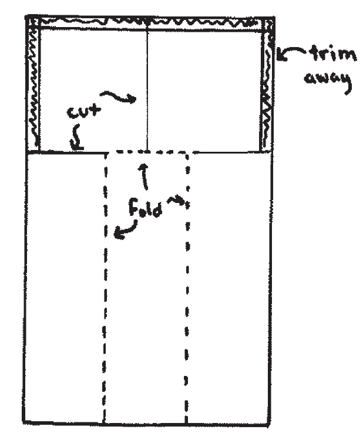

# Exercises of Regression and Other Stories

## Overview

Data for examples and assignments in this and other chapters are at `www.stat.columbia.edu/~gelman/regression/`. See Appendix A for an introduction to R, the software you will use for computing.

### From design to decision

Figure 1.9 displays the prototype for a paper “helicopter.” The goal of this assignment is to design a helicopter that takes as long as possible to reach the floor when dropped from a fixed height, for example 8 feet. The helicopters are restricted to have the general form shown in the sketch. No additional folds, creases, or perforations are allowed. The wing length and the wing width of the helicopter are the only two design parameters, that is, the only two aspects of the helicopter that can be changed. The body width and length must remain the same for all helicopters. A metal paper clip is attached to the bottom of the helicopter. Here are some comments from previous students who were given this assignment:

> Rich creased the wings too much and the helicopters dropped like a rock, turned upside down, turned
sideways, etc.
Helis seem to react very positively to added length. Too much width seems to make the helis unstable.
They flip-flop during flight.
Andy proposes to use an index card to make a template for folding the base into thirds.
After practicing, we decided to switch jobs. It worked better with Yee timing and John dropping. 3 –
2 – 1 – GO.

Your instructor will hand out 25 half-sheets of paper and 2 paper clips to each group of students.
The body width will be one-third of the width of the sheets, so the wing width can be anywhere
from $\frac{1}{6}$ to $\frac{1}{2}$ of the body width; see Figure 1.9a. The body length will be specified by the instructor. For example, if the sheets are U.S.-sized ($8.5\times5.5$ inches) and the body length is set to  3 inches, then the wing width could be anywhere from 0.91 to 2.75 inches and the wing length could be anywhere  from 0 to 5.5 inches.

```{r, fig.cap = "Diagram for making a ``helicopter'' from half a sheet of paper and a paper clip. The long segments on the left and right are folded toward the middle, and the resulting long 3-ply strip is held together by a paper clip. One of the two segments at the top is folded forward and the other backward. The helicopter spins in the air when dropped."}

```

```{r, echo = T, results='asis'}
library(tidyverse)
# Parameters
  # U.S. Presidential election results and GDP growth
file_helicopters <- here::here("data/ros-master/Helicopters/data/helicopters.txt")
helicopters <- 
  file_helicopters %>% 
  read.table(header = TRUE) %>% 
  as_tibble(.name_repair = str_to_lower)

helicopters %>% 
  kable(caption = "Data file showing flight times, in seconds, for 5 flights each of two identical helicopters
with wing width 1.8 inches and wing length 3.2 inches dropped from a height of approximately 8 feet. From
Gelman and Nolan (2017).")
```

In this assignment you can experiment using your 25 half-sheets and 10 paper clips. You can
make each half-sheet into only one helicopter. But you are allowed to design sequentially, setting
the wing width and body length for each helicopter given the data you have already recorded.
Take a few measurements using each helicopter, each time dropping it from the required height
and timing how long it takes to land.

#### (a)

Record the wing width and body length for each of your 25 helicopters along with your time measurements, all in a file in which each observation is in its own row, following the pattern of helicopters.txt in the folder Helicopters, also shown in Figure 1.9b.

#### (b)

Graph your data in a way that seems reasonable to you.

#### (c)

Given your results, propose a design (wing width and length) that you think will maximize the helicopter’s expected time aloft. It is not necessary for you to fit a formal regression model here, but you should think about the general concerns of regression. The above description is adapted from Gelman and Nolan (2017, section  20.4). See Box, Hunter, and Hunter (2005) for a more advanced statistical treatment of this sort of problem.

### Sketching a regression model and data

Figure 1.1b shows data corresponding to the fitted line y = 46.3 + 3.0x with residual standard deviation 3.9, and values of x ranging roughly from 0 to 4%.

#### (a)

Sketch hypothetical data with the same range of x but corresponding to the line $y = 30 + 10x$ with residual standard deviation 3.9.

#### (b)

Sketch hypothetical data with the same range of x but corresponding to the line $y = 30 + 10x$ with residual standard deviation 10.

### Goals of regression

Download some data on a topic of interest to you. Without graphing the data or performing any statistical analysis, discuss how you might use these data to do the following things:

#### (a) Fit a regression to estimate a relationship of interest.

#### (b) Use regression to adjust for differences between treatment and control groups.

#### (c) Use a regression to make predictions.

### Problems of statistics

Give examples of applied statistics problems of interest to you in which there are challenges in:

#### (a) Generalizing from sample to population.

#### (b) Generalizing from treatment to control group.

#### (c) Generalizing from observed measurements to the underlying constructs of interest.

### Goals of regression

Give examples of applied statistics problems of interest to you in which the goals are:

#### (a) Forecasting/classification.

#### (b) Exploring associations.

#### (c) Extrapolation.

#### (d) Causal inference.


## Causal inference

Find a real-world example of interest with a treatment group, control group, a pre-treatment predictor, and a post-treatment predictor. Make a graph like Figure 1.8 using the data from this example.

## Statistics as generalization

Find a published paper on a topic of interest where you feel there has been insufficient attention to:

#### (a) Generalizing from sample to population.

#### (b) Generalizing from treatment to control group.

#### (c) Generalizing from observed measurements to the underlying constructs of interest.

## Statistics as generalization

Find a published paper on a topic of interest where you feel the following issues have been addressed well:

#### (a) Generalizing from sample to population.
#### (b) Generalizing from treatment to control group.
#### (c) Generalizing from observed measurements to the underlying constructs of interest.

## A problem with linear models

Consider the helicopter design experiment in Exercise 1.1. Suppose you were to construct 25 helicopters, measure their falling times, fit a linear model predicting that outcome given wing width and body length:
$$
\text{time} = \beta_0 + \beta_1 ∗ \text{width} + \beta_2 ∗ \text{length}+ \text{error},
$$

\noindent and then use the fitted model $\text{time} = \beta_0 + \beta_1 ∗ \text{width} + \beta_2 ∗ \text{length}$ to estimate the values of wing width and body length that will maximize expected time aloft.

#### (a) Why will this approach fail?

#### (b) Suggest a better model to fit that would not have this problem.

### Working through your own example

Download or collect some data on a topic of interest of to you. You can use this example to work though the concepts and methods covered in the book, so the example should be worth your time and should have some complexity. This assignment continues throughout the book as the final exercise of each chapter. For this first exercise, discuss your applied goals in studying this example and how the data can address these goals.
