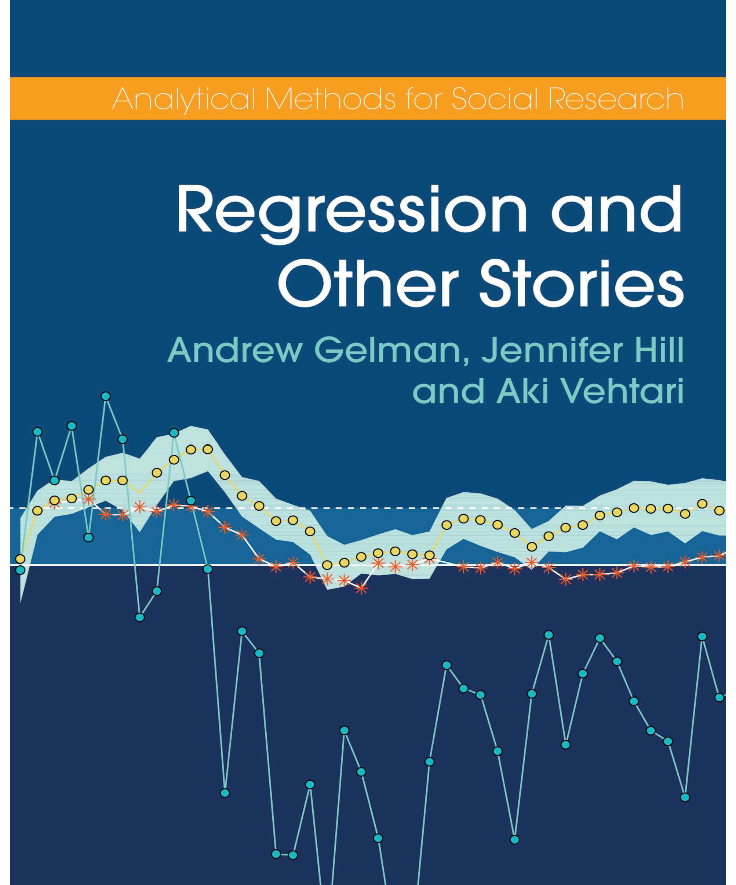

--- 
title: "Reading Notes for Regression and Other Stories"
subtitle: "by Andrew Gelman, Jeniffer Hill and Aki Vehtari"
author: "Sanghoon Park"
date: "`r Sys.Date()`"
site: bookdown::bookdown_site
output: bookdown::gitbook
header-include:
  - \usepackage{amsmath}
documentclass: book
bibliography: book.bib
biblio-style: apsr
link-citations: yes
github-repo: pherephobia/regression_hgv
---

```{r setup, include=FALSE}
knitr::opts_chunk$set(error = TRUE, echo = FALSE,
                      warning = FALSE, message = FALSE,
                      fig.align = "center")
library(tidyverse);library(patchwork);library(knitr)
```

# Overview

<br>
```{r, out.width="50%"}

```
<br>

이 책(이하 @ghv2020)은 예측모형을 만들고, 이해하고, 사용하는 데 있어서 마주할 수 있는 문제들을 다루고 있다. 우선 데이터, 측정, 그리고 통계치(statistics)에 관한 기본적인 개념들을 앞의 다섯개 챕터에서 검토하고, 하나의 예측변수와 여러개의 예측변수를 가지는 선형 회귀모델을 다룬다. 뒷 부분에서는 로지스틱 회귀모델을 포함한 일반화 선형모델들을 살펴보게 될 것이다.

저자들이 말하는 것처럼 이 책의 장점 중 하나는 단순히 기법적인 것들을 설명하는 것이 아닌, 이러한 모델들을 이용해서 어떻게 가지고 있는 데이터로부터 인과추론에 이르기까지 일반화를 할 수 있는지에 대한 회귀모델 "적용"의 문제를 다루고 있다는 것이다.

GHV를 읽고 정리한 이 리딩노트는 모든 내용을 요약하지 않고 필수적이라고 생각되는 예제들을 선택적으로 포함하여 본문의 Figure 나 Table과 캡션이나 레이블이 일치하지 않을 수 있다. 이를 참고하기 바란다.

## The three challenges of statistics

통계적 추론(statistical inference)에 있어서 마주할 수 있는 세 가지 문제는 다음과 같다:

  1. *표본을 가지고 모집단 수준으로 일반화를 해야하는 문제*. 이 문제는 설문 표집(survey sampling)과 관련되어 있지만, 사실 모든 통계 추론을 적용할 때 제기될 수 있는 문제이다. 왜냐하면 우리가 가진 데이터는 그것이 설문 데이터이건 아니건 간에 모두 하나의 표본(sample)이기 때문이다.
  
  2. *처치집단의 결과를 가지고 통제집단까지 일반화를 해야하는 문제*. 거의 대부분의 회귀모델을 해석하는데 있어서 야기되는 인과추론과 관련된 문제이다. 결국 회귀모델도, 통계모델도 일종의 준실험적(quasi-experimental)이라고 불리는 만큼, 어떻게 관계에 영향을 미치는 잡음(noise)과 체계적 요인(systematic factors)을 구분해 우리가 관심을 가지고 있는 관계를 드러낼 것인가에 대한 "통제"의 문제와 밀접하게 관련을 가진다.
  
  3. *관측된 측정지표를 가지고 우리가 관심을 가지고 있는, 그 측정지표 너머의(기저의) 구성개념으로 일반화를 해야하는 문제*. 대부분의 경우, 우리가 가지고 있는 데이터가 완벽하게 혹은 정확하게 우리가 이상적으로 연구하고자 하는 대상을 기록하고 있다고 보기는 어렵다. 예를 들어, 민주주의를 측정한다고 할 때, 우리가 개념적으로 기대하는 민주주의를 실제 측정지표로 완벽하게 포착하기는 어렵다. 따라서 우리는 일종의 조작화(operationalization)라는 과정을 거치게 되는데, 이때 우리의 개념화(conceptualization)와 조작화(operationalization) 간에는 필연적으로 간극이 생길 수 밖에 없게 된다. 이 간극을 어떻게 좁힐 것인가에 대한 문제라고도 이해할 수 있다.
  
위의 세 문제들은 "예측의 문제"(problems of prediction)라는 한 울타리 안에 담을 수 있다. 예를 들어, 새로운 사람들을 대상으로 했을 때, 변화한 표본이 이전의 표본과 마찬가지로 모집단 수준에서 일반화를 하기에 적절한지, 처치(treatment)가 달라졌을 때 이전과 이후의 결과가 어떻게 달라질지, 그리고 앞으로도 우리가 조작화한 측정지표가 우리가 기대한 개념을 정확하게 측정할지 등에 대한 문제가 산적해있는 것이다. 이런 점들을 고려하여 GHV는 이 책을 통해 다음과 같은 핵심 역량을 기르기를 주문한다.

+ *회귀모델을 이해하는 것*. 회귀모델이란 결국 일련의 예측변수들을 이용해서 결과과 어떠할 것이라고 예측하는 수리적 모델이다. 이 책은 그 예측을 일종의 선형(linear) 관계로 바라보는 것으로부터 다양한 비선형(non-linear) 관계로 일반화할 수 있는 단계로까지 이해할 수 있는 내용을 다룬다.

+ *회귀모델을 구성하는 것*. 회귀모델에 어떤 변수를 선택해서 포함시키고, 혹은 변수를 어떻게 변형시킬지 등은 연구자에게 주어진 선택지이다. 동일한 결과를 회귀모델로 분석하고자 하더라도 연구자마다 다른 변수들을 사용하여 분석할 수 있다. 

+ *데이터에 회귀모델을 적합시키는 것*. R과 Stan이라는 소프트웨어를 이용하여 데이터로부터 회귀모델을 적합, 그 분석 결과를 도출할 수 있는 스킬을 배우게 된다.

+ *회귀보델의 결과를 보여주고 해석하는 것*. 단순히 통계 분석을 수행하는 것이 아니라 그 결과가 가지는 의미를 다른 사람들이 이해할 수 있는 방식으로 보여주고 해석하는 것이 중요하다. 이를 위해서 통계 분석 이상의 프로그래밍 스킬과 수학적 이해를 요구한다.

마지막으로 이 책의 핵심 주제는 바로 *추론 (inference)*이다. 우리가 손에 넣은 특정한 데이터로부터 수리적 모델을 이용해 (모집단에서 통용되는) 일반화된 주장을 할 수 있는 능력을 의미한다.

## Why learn regression?

```{r, echo = F, fig.cap="Predicting elections from the economy: (a) the data, (b) the linear fit, y = 46.3 + 3.0x."}
# Parameters
  # U.S. Presidential election results and GDP growth
file_hibbs <- here::here("data/ros-master/ElectionsEconomy/data/hibbs.dat")
hibbs <- 
  file_hibbs %>% 
  read.table(header = TRUE) %>% 
  as_tibble()
fig1.1a <- hibbs %>% 
  ggplot(aes(growth, vote)) +
  geom_hline(yintercept = 50, color = "grey60") +
  geom_text(aes(label = year)) +
  scale_x_continuous(labels = scales::label_percent(accuracy = 1, scale = 1)) +
  scale_y_continuous(labels = scales::label_percent(accuracy = 1, scale = 1)) +
  labs(
    title = "Forecasting the election from the economy",
    x = "Average recent growth in personal income",
    y = "Incumbent party's vote share"
  ) + theme_bw()

fit <- lm(vote ~ growth, data = hibbs)
intercept <- coef(fit)[["(Intercept)"]]
slope <- coef(fit)[["growth"]]
eqn <- 
  str_glue(
    "y = {format(intercept, digits = 1, nsmall = 1)} + ",
    "{format(slope, digits = 1, nsmall = 1)} x"
  )

fig1.1b <- hibbs %>% 
  ggplot(aes(growth, vote)) +
  geom_hline(yintercept = 50, color = "grey60") +
  geom_abline(slope = slope, intercept = intercept) +
  geom_point() +
  annotate("text", x = 3.05, y = 53.75, label = eqn, hjust = 0) +
  scale_x_continuous(labels = scales::label_percent(accuracy = 1, scale = 1)) +
  scale_y_continuous(labels = scales::label_percent(accuracy = 1, scale = 1)) +
  labs(
    title = "Data and linear fit",
    x = "Average recent growth in personal income",
    y = "Incumbent party's vote share"
  ) + theme_bw()

fig1.1a + fig1.1b + plot_layout(ncol = 1)
```

회귀모델은 일련의 *예측변수*들로 정의된 개별 개체들에 따라서 *결과*의 평균적인 값, 혹은 예측이 어떻게 될 것이라는 걸 보여주는 방법이다. 예를 들어, Figure 1.1a는 미국 대선에서의 집권당의 득표율과 각 선거가 있었던 해에 경제성장률의 측정지표를 그래프로 보여주고 있다. Figure 1.1b는 그 데이터에 적합하는 선형 회귀모델의 결과를 보여준다. 회귀모델은 비록 어느정도의 불확실성은 존재하지만 변화하는 경제성장률에 따라 득표율이 어떻게 될 것이라는 예측이 가능하게 해주며, 그러한 가정 하에서 미래의 선거도 과거와 비슷하다면 어떻게 전개될 것이라고 기대할 수 있게 해준다.

GHV는 Stan을 이용해 베이지안 통계 패키지를 이용해 회귀모델을 분석하고 있지만, 여기서는 일반적인 패키지를 이용해 분석한다. 회귀분석에 대한 자세한 내용은 이후의 챕터들에서 다루게 될 것이다.

회귀모델이 주요하게 사용되는 것은 다음과 같다:

  + *예측*: 가지고 있는 데이터를 모델링하거나 새로운 데이터를 예측하는 것을 의미힌다. 
  
  + *관계의 탐색*: 얼마나 변수들이 결과를 잘 예측하는지를 보여주는 것이 필요하다.
  
  + *외삽(extrapolation)*: 여기서는 외삽이라는 개념을 사용했는데, 그보다는 일반화(generalization)라는 표현이 좀 더 이해하기 쉬울 듯 하다. *표본*과 *모집단*의 차이를 알아야 한다는 것에서 시작한다. 현실세계의 표본은 결코 모집단을 완벽하게 대표할 수 없기 때문에, 우리는 표본을 통해서 얻은 결과를 모집단의 수준에서 일반화하는 과정에서 일종의 조정 과정을 거치게 되는데, 이를 외삽이라고 표현한 것이다. 회귀분석은 Figure 1.1b에서 보았듯 일종의 예측을 제시하지만 어디까지나 주어진 표본 하에서 그 선은 그어진 것이고, 앞으로도 계속 그 추세가 이어질지는 알지 못한다. 그럼에도 불구하고 우리는 주어진 데이터에서 모델을 이용한 예측을 일반화화된 진술로 표현하게 된다.
  
  + *인과추론*: **회귀모델에서 가장 중요한 부분으로, 처치효과(treatment effects)를 추정하는 것에 관련된 것**이다. 즉, 우리가 기대하는 어떠한 변수가 진짜로 결과의 차이를 가져오는 데 기여하였는가, 그렇다면 얼마나 기여하였는가를 추정하는 것이다. 인과추론은 평균적으로 얼마나 처치 이전에 처치군과 통제군이 유사하였는지, 그리고 처치 이후에 두 집단의 차이가 존재하였는지를 확실히 보여주는가에 그 성패가 달려있다고 할 수 있다.

## Some examples of regression

### A randomized experiment on the effect of an educational television program

```{r, echo = F, fig.cap = "Post-treatment classroom-average test scores from an experiment measuring the effect of an educational television program, The Electric Company, on children’s reading abilities. The dark vertical line in each histogram shows the average for the corresponding group of classrooms."}
file_electric_wide <- here::here("data/ros-master/ElectricCompany/data/electric_wide.txt") 
electric_wide <- read_table2(file_electric_wide)

electric_post <- 
  electric_wide %>% 
  pivot_longer(
    cols = matches("(control|treated)_(pretest|posttest)"),
    names_to = c("group", "test"),
    names_pattern = "(.*)_(.*)",
    values_to = "score"
  ) %>% 
  filter(test == "posttest")

score_means <- 
  electric_post %>% 
  group_by(grade, group) %>% 
  summarize(score_mean = mean(score)) %>% 
  ungroup()

grade_labels <- function(x) str_glue("Grade {x}")
group_labels <- 
  c(
    control = "Control classes",
    treated = "Treated classes"
  )

electric_post %>% 
  ggplot(aes(score)) +
  geom_histogram(binwidth = 5, boundary = 0) +
  geom_vline(aes(xintercept = score_mean), data = score_means) +
  facet_grid(
    rows = vars(group),
    cols = vars(grade),
    labeller = labeller(grade = grade_labels, group = group_labels)
  ) + 
  labs(
    title = 
      "Effect educational television program on chilren's reading scores",
    subtitle = 
      "Vertical line shows the average for the corresponding group of classrooms",
    x = "Score",
    y = "Count"
  ) + theme_bw()
```

1970년대 새로운 TV 교육 프로그램(`The Electric Company`)이 어린이들의 독해력에 미치는 효과를 측정하기 위해 수행된 연구를 살펴보자.

  + 실험대상은 미국의 두 작은 도시에 1-4학년 사이의 아이들이었다.
  
  + 각 도시와 학년에 따라서 10개부터 20개 사이의 학교가 선택되었고, 각 학교는 독해력 시험 점수가 가장 낮은 해당 학년의 두개 학급씩을 선정하였다.
  
  + 각 2개 학급별로 한 학급은 무작위로 정규 독해 강의를 듣게 했고, 다른 학급은 TV 프로그램을 시청하게 하였다.
  
    + 즉, 성적이 최하위인 `A`와 `B`라는 같은 학년의 두 학급을 선정 후, `A`에서 무작위로 뽑은 학생들은 정규 독해 강의를 듣고, `B`에서 무작위로 뽑은 학생들은 TV 프로그램을 보게 한 것이다. 따라서 `A`는 강의를 들은 학생들과 듣지 않은 학생, `B`는 TV 프로그램을 본 학생과 보지 않은 학생으로 구분할 수 있다.
    
  + 각 학생들은 학년이 시작하기 전에 사전 테스트를 쳤고, 학년 말에 사후 테스트를 쳤다.

Figure 1.2는 각 학년별 통제 학급과 처치 학급의 사후 테스트 결과를 보여준다. 각 행을 비교하면 통제 학급에 비해 처치 학급이 저학년(Grade 1, Grade 2)의 경우 TV 프로그램을 시청하였을 때 더 높은 독해력을 보여주는 것을 확인할 수 있고, 그 차이는 고학년(Grade 3, Grade 4)으로 가면 줄어드는 것을 확인할 수 있다. 물론, 더 자세한 처치 효과를 추정하기 위해서는 통계적 분석이 필요하다(제19장에서 다시 살펴본다).

### Comparing the peacekeeping and gun-control studies

GHV는 UN의 평화유지군 파병이 내전이 발생했던 국가가 다시 내전에 재돌입하는 것에 미치는 효과를 본 연구와 일련의 총기 관련 정책이 가지는 효과를 두루 살펴본 연구를 비교하면서 다음과 같은 함의를 이끌어내고 있다.

+ 보고자 하는 것이 무엇인지(연구문제)를 명확히 하고, 그에 맞는 연구설계를 할 필요가 있다. 그 경우에 보다 믿을 수 있고 설득력 있는 결과를 제시할 수 있다.

+ 한 번에 하나의 모델에서 너무 많은 인과관계를 보여줄 필요는 없다. 변수를 많이 추가할수록 조건이 추가되는 것이다. 즉, `A`가 일정할 때, `B`가 결과에 미치는 효과는 어떠할 것이다라는 진술과 `A`부터 `G`까지의 변수들이 일정할 때, `H`가 변수에 미치는 효과는 어떠할 것이다라는 진술은 현실 세계에서 우리가 그 결과를 직관적으로 이해할 수 있는가에 영향을 미칠 수 있다.

+ 마찬가지로 비교하고자 하는 대상--분석 단위에 대한 고민도 필요하다. 분석 단위들 간에 존재할 수 있는 체계적 차이를 어떻게 고려하느냐도 우리의 결과가 가지는 신빙성에 영향을 미칠 수 있기 때문이다.

## Challenges in building, understanding, and interpreting regressions

인과추론을 위한 회귀모델에 있어서 두 가지를 구분할 수 있다: 관계를 추정하는 것과 비교하고자 하는 대상들의 기저에 놓인 변수들을 조정(adjusting)하는 것이다.

### Regression to estimate a relationship of interest

어떤 처치군과 통제군을 비교한다고 가정해보자. 일단 첫 번째 생각해야할 조건은 처치군과 통제군에 들어갈 사람들이 무작위로 배정되었는지(randomly assigned)에 대한, *"무작위화"(randomization)*이다. 혹은 배정이 두 집단 간의 균형을 고려한 보다 복잡한 설계를 바탕으로 이루어졌을 수도 있다. 처치군과 통제군을 대략적으로(완벽하게 동일한 개체가 될 수는 없으니까) 비교가능한 집단으로 만드는 것과 이 두 집단 간에 알려진, 혹은 모델에 포함된 차이를 조정하는 방법은 다양하게 존재한다.

```{r, echo = F}
set.seed(1234)

n <- 50

df_1 <- 
  tibble(
    x = runif(n, min = 1, max = 5),
    x_binary = if_else(x < 3, 0, 1),
    y = rnorm(n, mean = 10 + 3 * x, sd = 3)
  )
```

```{r, echo = F, fig.cap = "Regression to estimate a causal effect with (a) simple comparison of treatment and control, or (b) a range of treatment levels.", fig.height=4, fig.width=8}

lm_1a <- lm(y ~ x_binary, data = df_1)

slope <- coef(lm_1a)[["x_binary"]]
intercept <- coef(lm_1a)[["(Intercept)"]]

fig1.3a <- df_1 %>% 
  ggplot(aes(x_binary, y)) +
  geom_point() +
  geom_abline(slope = slope, intercept = intercept) +
  scale_x_continuous(
    breaks = 0:1,
    minor_breaks = NULL,
    labels = c("Control", "Treatment")
  ) +
  labs(
    title = "Regression with binary treatment",
    x = NULL,
    y = "Outcome measurement"
  ) + theme_bw()

lm_1b <- lm(y ~ x, data = df_1)

slope <- coef(lm_1b)[["x"]]
intercept <- coef(lm_1b)[["(Intercept)"]]

label = 
  str_glue(
    "Estimated treatment\n",
    "effect per unit of x is\n",
    "slope of fitted line: {format(coef(lm_1b)[['x']], digits = 1, nsmall = 1)}"
  )

fig1.3b <- df_1 %>% 
  ggplot(aes(x, y)) +
  geom_point() +
  geom_abline(slope = slope, intercept = intercept) +
  annotate("text", x = 1.5, y = 24, label = label, hjust = 0) +
  labs(
    title = "Regression with continuous treatment",
    x = "Treatment level",
    y = "Outcome measurement"
  ) + theme_bw()

fig1.3a + fig1.3b + plot_layout(ncol = 2)
```

```{r, echo = F, fig.cap = "(a) Hypothetical data in which the causal effect is a nonlinear function of the treatment level; (b) same data with a linear effect estimated. It is always possible to estimate a linear model, even if it does not fit the data.", fig.height=4, fig.width=8}

n <- 50

df_2 <- 
  tibble(
    x = df_1$x,
    y_mean = 5 + 30 * exp(-x),
    y = rnorm(n, mean = y_mean, sd = 2)
  )

m_2 <- lm(y ~ x, data = df_2)

fig1.4a <- df_2 %>% 
  ggplot(aes(x)) +
  geom_point(aes(y = y)) +
  geom_line(aes(y = y_mean)) +
  scale_y_continuous(breaks = scales::breaks_width(2)) +
  labs(
    title = "Nonlinear treatment effect",
    subtitle = "Nonlinear function",
    x = "Treatment level",
    y = "Outcome measurement"
  ) + theme_bw()

lm_2 <- lm(y ~ x, data = df_2)

slope <- coef(lm_2)[["x"]]
intercept <- coef(lm_2)[["(Intercept)"]]

fig1.4b <- df_2 %>% 
  ggplot(aes(x)) +
  geom_point(aes(y = y)) +
  geom_abline(slope = slope, intercept = intercept) +
  scale_y_continuous(breaks = scales::breaks_width(2)) +
  labs(
    title = "Nonlinear treatment effect",
    subtitle = "Linear model",
    x = "Treatment level",
    y = "Outcome measurement"
  ) + theme_bw()

fig1.4a + fig1.4b + plot_layout(ncol = 2)
```

만약 처치, $x$가 결과, $y$에 미치는 효과에 관심이 있고 가지고 있는 데이터가 무작위화 혹은 다른 처치군과 통제군 간의 균형을 고려한 실험설계 방법을 통해 얻어졌다면 우리는 회귀모델을 데이터에 적합하여 불확실성을 포함해 $x$로부터 $y$를 예측할 수 있다.[^1-1]

만약 $x$가 이항변수(통제일 경우 $x=0$, 처치가 이루어졌을 경우 $x=1$)라면 회귀모델 분석의 결과는 Figure 1.3a와 같이 나타날 것이고, 만약 $x$가 연속적인 값을 같는 변수라면 Figure 1.3b와 같은 결과를 확인할 수 있을 것이다.

실험방법을 통해 두 집단 간의 비교가능성이 확보된 상황이라면 주어진 처치에 대해 결과를 예측한 회귀분석 결과는 인과효과(causal effect)를 직접적으로 추정한 것이라고 할 수 있다.

하지만 데이터를 더 잘 설명하기 위해, 혹은 더 정확하게 예측하기 위해 더 정교한 모델링을 할 수도 있다. 예를 들어, 연속형 변수의 처치효과가 결과에 비선형적인 관계를 가지는 경우를 생각해볼 수 있다. Figure 1.4a가 바로 그런 경우이다. Figure 1.4a와 Figure 1.4b 모두 같은 데이터를 예측하지만 처치 효과의 관계가 선형적이냐, 비선형적이냐에 따라 다른 기대를 가지고 있는 모델이다.

혹은 모델 내 서로 다른 예측변수들 간의 함수적 관계에 따라 처치효과가 다르게 나타나는 상호작용(interactions)을 모델에 포함할 것을 고려해볼 수 있다.

```{r, echo = F, fig.cap = "Lifetime added risk of lung cancer for men, as a function of average radon exposure in picocuries per liter (pCi/L). The relation between cancer rate and radon is different for smokers and nonsmokers."}
tibble(radon = c(0, 20, 0, 20),
       p     = c(.07409 + c(0, 20) * .0134,
                 .00579 + c(0, 20) * .0026),
       group = c("Smokers", "Smokers", "Nonsmokers", "Nonsmokers")) %>% 
  ggplot(aes(x = radon, y = p, group = group)) +
  geom_line() +
  annotate(geom = "text",
           x = 10, y = c(.05, .18),
           label = c("Nonsmokers", "Smokers")) +
  scale_x_continuous("Home radon exposure (pCi/L)", breaks = 0:6 * 2,
                     expand = expansion(mult = c(0, 0.05))) +
  scale_y_continuous("Probability of lung cancer",
                     expand = expansion(mult = c(0, 0.05))) +
  labs(subtitle = "Example of an interaction") +
  coord_cartesian(xlim = c(0, 12),
                  ylim = c(0, 0.25)) + theme_bw()
```

Figure 1.5은 라돈 가스가 남성의 폐암 발병률에 미치는 효과를 추정한 것을 보여준다. 라돈은 폐암을 발병시키고, 그 효과는 비흡연자에 비해 흡연자들에게서 더 크게 나타난다. 이 모델은 라돈의 효과가 선형적이라고 가정하며 동시에 흡연과 상호작용할 것이라는 가정을 하고 있다.

### Regression to adjust for differences between treatment and control groups

현실의 인과추론의 문제에서 처치와 통제가 이루어지는 피험체(experimental units) 간에는 체계적 차이(systematic difference)가 존재한다.[^1-2] Figure 1.6은 가상으로 만든 데이터와 그에 적합하는 선형회귀모델을 시각화한 것이다. Figure 1.6은 다음과 같이 요약할 수 있다.

> 처치를 받은 단위의 평균은 $\bar{y}=31.7$로 통제된 단위의 평균인 $\bar{y}=25.5$에 비해 4.8 포인트 높았다. 그러나 두 집단은 처치가 이루어지기 이전의 예측변수에 있어서 차이를 보였다: 예측변수, $x$의 평균인 $\bar{x}$는 처치군에서는 0.4였고, 통제군에서는 1.2였다. 이러한 차이를 조정한 이후에는 처치효과가 10.0이라고 추정할 수 있었다.

따라서 주요 예측변수에 있어서 처치/통제 단위 간 불균형(imbalance)이 존재한다고 할 때에는 그 불균형을 어느 정도 조정(adjustment) 해주는 것이 필요하다.

```{r, echo = F, fig.cap = "Hypothetical data with a binary treatment and a continuous pre-treatment variable. Treated units are displayed with circles on the scatterplot, and controls are shown with dots. Overlaid is a fitted regression predicting the outcome given treatment and background variable, with the estimated treatment effect being the difference between the two lines."}
n <- 100

not_used <- rnorm(n)  # To match example in book

df_3 <- 
  tibble(
    x_2 = rep(0:1, n / 2),
    x_1 = 
      if_else(
        x_2 == 0,
        rnorm(n, mean = 0, sd = 1.2)^2,
        rnorm(n, mean = 0, sd = 0.8)^2
      ),
    y = rnorm(n, mean = 20 + 5 * x_1 + 10 * x_2, sd = 3)
  )

lm_3 <- lm(y ~ x_1 + x_2, data = df_3)


slope <- coef(lm_3)[["x_1"]]
intercept_0 <- coef(lm_3)[["(Intercept)"]]
intercept_1 <- coef(lm_3)[["(Intercept)"]] + coef(lm_3)[["x_2"]]

lines <- 
  tribble(
    ~slope,  ~intercept,
     slope, intercept_0,
     slope, intercept_1
  )

label <- 
  str_glue(
    "Estimated treatment\n",
    "effect is {format(coef(lm_3)[['x_2']], digits = 1, nsmall = 1)}"
  )

ggplot() +
  geom_point(aes(x_1, y, color = as.factor(x_2)), data = df_3) +
  geom_abline(aes(slope = slope, intercept = intercept), data = lines) +
  annotate(
    "segment",
    x = 4.2,
    xend = 4.2,
    y = intercept_0 + slope * 4.2,
    yend = intercept_1 + slope * 4.2,
    arrow = arrow(length = unit(0.04, units = "npc"), ends = "both")
  ) +
  annotate("text", x = 3.8, y = 36, label = label, hjust = 0) +
  scale_color_discrete(breaks = 0:1, labels = c("Controls", "Treated")) +
  theme(legend.position = "bottom") +
  labs(
    title = "Continuous pre-treatment predictor and binary treatment",
    x = "Pre-treatment predictor",
    y = "Outcome measurement",
    color = NULL
  ) + theme_bw() + theme(legend.position = "bottom")
```

### Interpreting coefficients in a predictive model

회귀모델은 일종의 예측모델이지만 만약 모델 내에 포함된 오차(errors)가 클 경우에는 무언가를 *예측하는 것*에는 거의 무용하다(useless). 다만 회귀모델은 추정된 기울기(estimated slope)를 통해 관측된 데이터의 변수들 간의 관계 양상을 *탐색하는 것*에 유용하다. 오차를 포함하더라도 그 관계가 정(positive)인지 부(negative)인지에 대한 패턴을 보여주기 때문이다. 또한 회귀모델은 표집(sampling)을 통한 추론이기 때문에, 우리는 회귀모델을 적합한 표본(sample)이 우리가 알고자 하는 모집단(population)에 대해 대표성을 가질 것이라고 기대하고 그 결과를 모집단 수준에서 직접적으로 해석할 수 있다. 혹은 표본과 모집단 간의 간극을 좁히기 위해 모델에 추가적인 예측변수들을 포함할 수도 있다. 여기서 알 수 잇는 것은 첫째, 표본이 대표성을 가지지 못한다면 표본을 통해 얻은 결과를 모집단 수준에서 해석하는 것에서 왜곡이 일어날 수 있다는 것, 둘째는 예측변수들을 추가함으로써 우리는 표본과 모집단 간의 간극을 좁힐수도 있지만 동시에 잘못된 예측변수를 추가하게 되면 그 간극이 오히려 넓어질수도 있다는 것이다. 회귀모델을 *인과추론*으로 해석하는 것이 일견 자연스러워 보이지만 모델 안에 포함되어야 하지만 우리가 관측하지 못해 포함하지 못한 변수들(lurking variables or confounders)이 존재할 수 있기 때문에 회귀모델은 완벽한 통제(control)가 이루어진다고 볼 수 없다. 따라서 회귀모델을 통해 인과추론을 하는 것에는 주의가 필요하다.

### Building, interpreting, and checking regression models

통계분석은 다음과 같은 네 단계를 거쳐서 수행된다:

+ $y = \alpha + \beta x + \mathrm{error}$의 형태로 단순선형모델로 시작해 추가적인 예측변수들($x_2\cdots x_n$), 상호작용, 그리고 변형된 변수(transformations)들을 추가하는 것으로 확장되는 모델 구축(model building) 단계.

+ 데이터 조작(data manipulation), 프로그래밍, 그리고 회귀계수와 불확실성을 추정하고 확률적 예측을 하기 위한 알고리즘의 사용을 포함한 모델 적합(model fitting) 단계.

+ 그래픽과 프로그래밍, 그리고 측정지표와 모수, 그리고 연구 기저에 놓인 목적 간의 (불완전한) 관계를 적극적으로 조사하는 모델 등의 적합도(model fit)을 이해하는 단계.

+ 모델을 발전시키기 위한 방향을 고민하고 비판하는 단계. 어떠한 연구도 완벽하지 않다(No study is perfect).

## Classical and Bayesian inference

GHV는 기본적으로 베이지안 추론을 사용하지만, 이 리딩노트는 기본적으로 빈도주의적 접근을 취하고자 한다. 하지만 이 장에서의 베이지안 추론의 소개는 알아둘만한 것이기에 간단히 정리한다.

통계를 하는 사람으로서 우리는 데이터에 모델을 적합하고 그 모델을 이용해 예측하는 데 많은 공을 들인다. 그리고 이러한 단계들은 방법론적, 철학적 이론틀에 바탕을 두고 있다. 전통적인(빈도주의적인) 분석틀과 베이지안 분석틀 모두가 취하고 있는 공통적인 접근법으로는: (1) 추정(estimation) 과정에 어떠한 *정보(information)*가 사용되는가, (2) 어떤 *가정(assumptions)* 하에서 이루어지는가, (3) 추정치와 예측값을 어떻게 *해석(interpretation)*하는가 등이 있다.

### Information

어떤 회귀모델이던간에 결과변수(종속변수), $y$와 하나 이상의 예측변수, $x$에서 시작한다. 데이터 그 자체에 더해 우리는 데이터가 어떻게 수집되는지에 대한 정보도 필요하며, 데이터의 가용성 여부에 대한 정보도 필요하다. 마지막으로 우리는 지금 당장 가지고 있는 데이터뿐 아니라 이전의 경험, 유사한 연구 등을 바탕으로 일종의 *사전적 지식(prior knowledge)*을 가지게 된다. 그리고 연구에 있어서 이러한 정보들을 어떻게 반영하는가, 모델에 포함시키는가는 주위해야한다. 예를 들어, 기게재된 연구논문들은 "통계적 유의성"을 보이는 결과, 혹은 큰 효과를 보이는 결과를 선별적으로 보여주어야 출판될 수 있다는 압박에 효과를 과다추정하는 경향을 보일 수 있다. 이 경우, 데이터가 충실하지 않고, 사전적 지식이 없다면 말이 되지 않는 결론을 도출할 수 있다.

### Assumptions

예측변수 $x$와 결과변수 $y$에 대한 회귀모델에는 약 세 가지 핵심적인 가정이 필요하다.

1. $x$와 $y$의 관계에 대한 함수적 형태에 관한 가정이 필요하다.

2. 데이터가 어디서 오는가에 대한 가정이 필요하다. 다른 책이나 연구논문에서는 데이터 생성과정(Data Generating Process; DGP)이라고도 한다. 기본적으로는 표본으로 우리가 확보하게 될 데이터의 (결코 관측될 수 없는) 모집단이 어떻게 생겨먹었나에 대한 가정이라고 할 수 있다.

3. 측정된 데이터가 과연 실제 현실세계에 대한 적절성(relevance)을 가지는가에 대한 가정이 필요하다.

### Classical inference

빈도주의적 접근(frequentist approach)이라고도 한다. 사전적 정보가 아닌, 우리가 관측하여 확보한 데이터의 정보를 요약하고 가급적 편향되지 않고 분산 정도가 적은 추정치와 예측치를 얻고자 하는 데 그 목적이 있다. 그리고 당연히 표본을 통해 추론하는 것이니 만큼, 표본을 얻는 데 필연적으로 포함되는 불확실성이 존재한다. 

### Bayesian inference

베이지안 추론은 단순히 존재하는 데이터를 요약하는 것을 넘어 사전적 정보를 포함하여 추론하는 접근법이다. 예컨데, 만약 선행연구가 어떠한 경험적 연구를 축적해 와서 핵심 예측변수가 결과변수에 미치는 평균적 효과에 대한 "사전적 정보"가 존재한다고 할 때, 그 사전적 정보를 이용하여 사후에 얻은 데이터에 반영, *사후 분포(post distribution)*를 추정하는 방법인 것이다.

  + 장점: 보다 합당한 결과를 확인할 수 있으며, 미래의 결과/미래 실험의 결과에 대해 직접적인 예측이 가능하다.
  
  + 단점: 사전 분포(prior distribution)라고 하는 추가적인 정보가 필요하다.

전통적 추론은 예측값으로 한정되는 데이터의 요약을 보여줄 수 있다면, 베이지안 추론은 관측된 데이터가 빈약하더라도 추가적인 가정에 의존하여 이론으로부터 타당한 예측을 도출할 수 있다.--절대적으로 옳은 한 가지 방법이 있는 것은 아니다.

## Computing least squares and Bayesian regression

베이지안 접근법과 시뮬레이션 접근법은 정규화(regularized) 선형회귀모델이나 멀티레벨 모델을 적합할 때 보다 중요하다.[^1-3] 

[^1-1]: 당연히 불확실성이 나타날 수밖에 없다. 회귀모델은 어디까지나 "평균적인" 결과를 예측하는 것이니까.
[^1-2]: 여기에서 체계적 차이란 잡음(noise) 혹은 비체계적 차이(non-systematic difference/error)와 대응되는 개념으로, 비교 대상 간 일정한 차이의 패턴이 존재한다는 것을 의미한다.
[^1-3]: 정규화 선형회귀모델은 선형회귀 계수에 일종의 가중치(weight)에 대한 제약 조건을 추가함으로써 모형이 과도하게 최적화되는 현상, 즉 과최적화를 막는 방법이다.
